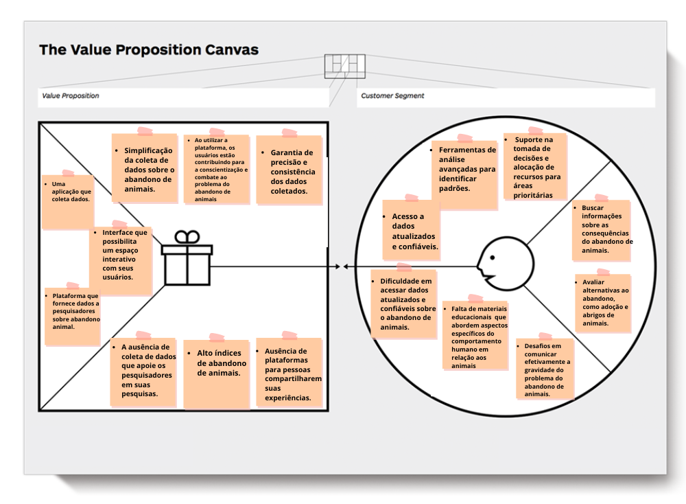
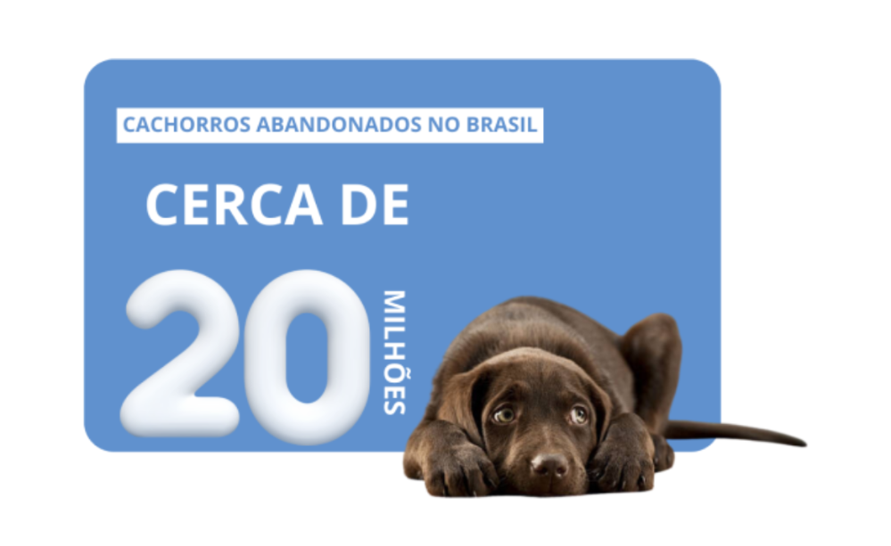
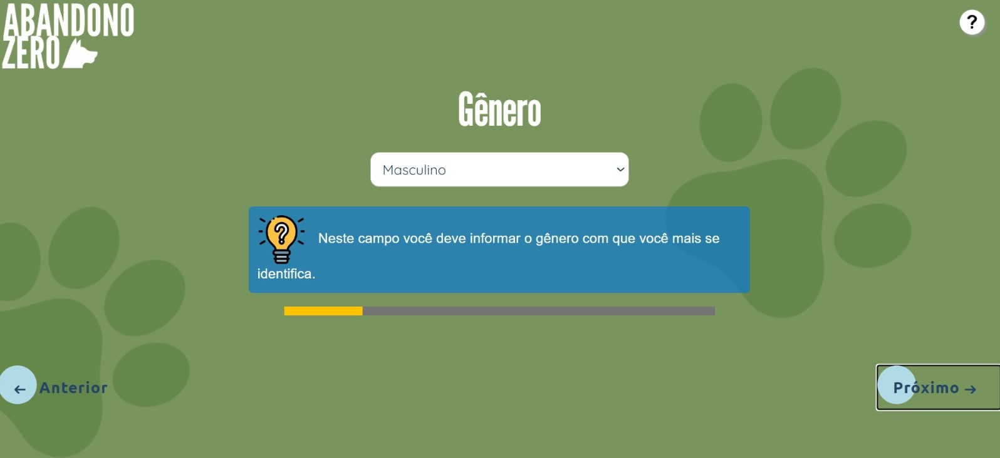

# WAD - Web Application Document - Módulo 2 - Inteli

## AnimalWare

#### Nomes dos integrantes do grupo
 <a href="https://www.linkedin.com/in/bernardofmeirelles/">Bernardo de Figueiredo Meirelles</a> <br/>
 <a href="https://www.linkedin.com/in/daviversan/?utm_source=share&utm_campaign=share_via&utm_content=profile&utm_medium=android_app">Davi D'avila Versan</a> <br/>
<a href="https://www.linkedin.com/in/fernando-soares-oliveira/">Fernando Soares de Oliveira</a> <br/>
<a href="https://github.com/Gbacci?tab=repositories">Gabriel Bacci Toledo</a> <br/>
<a href="https://www.linkedin.com/in/karine-victoria-822721203/">Karine Victoria Rosa da Paixão</a> <br/>
<a href="https://www.linkedin.com/in/tainacortez/">Tainá de Paiva Cortez</a> <br/>
<a href="https://www.linkedin.com/in/vinicius-ibiapina-90407328b/">Vinicius Gomes Ibiapina</a>


## Sumário

[1. Introdução](#c1)

[2. Visão Geral da Aplicação Web](#c2)

[3. Projeto Técnico da Aplicação Web](#c3)

[4. Desenvolvimento da Aplicação Web](#c4)

[5. Testes da Aplicação Web](#c5)

[6. Conclusões e trabalhos futuros](#c6)

[7. Referências](#c7)

[Anexos](#c8)

<br>


# <a name="c1"></a>1. Introdução

&nbsp;&nbsp;&nbsp;&nbsp;
No contexto atual, o abandono de animais é uma questão alarmante que afeta comunidades em todo o mundo. Enquanto esforços significativos têm sido feitos para abordar esse problema, a falta de dados concretos sobre os motivos que levam os donos a abandonarem seus animais representa um desafio significativo. Compreender as razões por trás do abandono é fundamental para desenvolver estratégias eficazes de prevenção e intervenção. Este projeto busca preencher essa lacuna, explorando a relação entre a falta de dados sobre os motivos do abandono de animais e os próprios motivos do abandono. Ao fazê-lo, não apenas esperamos fornecer dados para informar políticas e programas de conscientização, mas também contribuir para a proteção e o bem-estar dos animais em nossas comunidades.

&nbsp;&nbsp;&nbsp;&nbsp;
Estamos criando um website com um questionário que terá como objetivo coletar dados de usuários que tem, tiveram ou terão cachorros. Esses dados serão armazenados e posteriormente utilizados pelo INSPA (Instituto de Psicologia Animal), que busca oferecer cursos de pós-graduação que focam no comportamento e bem-estar humano-animal, para entender melhor o contexto de abandonos de cachorros e dessa forma tomar medidas efetivas baseadas em dados para acabar com esse problema. 

# <a name="c2"></a>2. Visão Geral da Aplicação Web 

## 2.1. Escopo do Projeto 

### 2.1.1. Contexto da indústria 

&nbsp;&nbsp;&nbsp;&nbsp; O entendimento do contexto da indústria é muito importante para qualquer projeto e parceria empresarial. Ao reunir informações relevantes, é possível formular um panorama  do _core business_ da empresa e dos setores envolvidos, bem como identificar os serviços oferecidos e potenciais concorrentes.

&nbsp;&nbsp;&nbsp;&nbsp; O INSPA é uma instituição de educação de âmbito nacional que atua na divulgação, formação continuada, implementação de estratégias, aplicação e produção de conhecimento nas áreas de comportamento, saúde animal e setores afins. [1]

&nbsp;&nbsp;&nbsp;&nbsp; Diante disso, o mercado de psicologia animal encontra-se em plena expansão, decorrente do constante aumento no número de pessoas que buscam adotar ou comprar um pet, além da demanda do conhecimento especializado de como melhorar a qualidade de vida desses animais. [2] Por fim, entre os principais _players_ destacam-se as clínicas veterinárias com foco em bem-estar animal e outras plataformas de ensino dessa área como a Ethos Animal, Psicovet e a Sociedade Paulista de Medicina Veterinária [3]

### 2.1.2. Modelo de 5 Forças de Porter
&nbsp;&nbsp;&nbsp;&nbsp;As cinco forças de Porter, elaboradas por Michael Porter,  permitem a compreensão da competição em uma indústria ou setor. Elas incluem o poder de barganha dos fornecedores e compradores, a rivalidade entre concorrentes existentes, a ameaça de novos entrantes e a ameaça de produtos ou serviços substitutos. Essa análise é essencial para empresas identificarem oportunidades e ameaças, capacitando-as a desenvolver estratégias que as mantenham competitivas no mercado. A figura 1 situa as 5 forças de porter do Inspa. 

<div align="center">
  <p> <b>Figura 1</b> - 5 Forças de Porter</p>

 <p><b>Fonte:</b> Material elaborado pelos autores (2024)</p>
</div>

- __Poder de barganha dos fornecedores:__ Os fornecedores do INSPA podem oferecer uma variedade de recursos, como materiais de estudo atualizados, instrutores qualificados e tecnologias para aulas online. Com a quantidade de médicos veterinários formados que podem atuar como instrutores[4] e uma grande quantidade de materiais de estudos disponíveis, o INSPA tem considerável controle sobre as negociações, o que resulta em um menor poder de barganha por parte dos fornecedores.

- __Poder de barganha dos compradores:__ O poder de barganha dos clientes pode ser considerado alto, uma vez que existe uma ampla variedade de cursos com modelos e conteúdos semelhantes, como aulas gratuitas online e videos no _youtube_. Dessa forma, os clientes têm a liberdade de escolha, o que consequentemente eleva o poder de negociação dos compradores.

- __Ameaça de novos entrantes:__ A ameaça de novos entrantes no mercado de educação em comportamento animal pode ser considerada moderada a alta. O fato de o INSPA ser pioneiro nesse campo e oferecer aulas online acessíveis para a pós-graduação pode criar barreiras para a entrada de novas instituições. No entanto, é importante destacar que o INSPA não tem controle absoluto sobre o mercado, pois o aumento de interesse nessa área e a preferência por aulas presenciais podem, eventualmente, incentivar o surgimento de novos competidores.

- __Ameaça de produtos ou serviços substitutos:__ A ameaça pode ser considerada moderada a baixa, especialmente porque o INSPA oferece um programa completo, incluindo cursos e pós-graduações em vários conteúdos específicos, de forma online, alcançando um amplo público. Isso dificulta o surgimento de alternativas inovadoras que possam  se apresentar como substitutas.

- __Rivalidade entre os concorrentes existentes:__ A rivalidade entre os concorrentes existentes é moderada. Apesar do INSPA ter sido pioneiro e inovador em muitos aspectos, sofre riscos significativos no que se refere ao domínio de mercado, tendo em vista que há um crescente número de alternativas para os serviços oferecidos. Como exemplos, podem ser citadas as seguintes instituições: Ethos Animal, Psicovet e a Sociedade Paulista de Medicina Veterinária.


### 2.1.3. Análise SWOT

&nbsp;&nbsp;&nbsp;&nbsp; A análise SWOT é uma ferramenta estratégica de planejamento que avalia a situação de uma organização, empresa ou empreendimento, considerando suas Forças e Fraquezas internas, bem como as Oportunidades e Ameaças externas. A matriz SWOT é uma representação visual desta análise, facilitando a compreensão e a tomada de decisões. Ela nos ajudará a identificar os pontos fortes e fracos de uma empresa, além de detectar oportunidades e ameaças potenciais, contribuindo para uma melhor estratégia de negócios. A análise SWOT do Inspa mostra que o instituto se situa em um mercado bem diverso, conforme podemos observar na figura 02:

<div align="center">
  <p> <b>Figura 2 </b> - Matriz SWOT</p>

 <p><b>Fonte:</b> Material elaborado pelos autores (2024)</p>
</div>

## Forças (*Strengths*):
- __Pioneirismo:__ O Inspa é reconhecido como pioneiro e líder na área da psicologia animal no Brasil [5], com uma reputação consolidada ao longo dos anos. O Inspa é considerado por muitos como um instituto à frente de seu tempo, não apenas pela ideia revolucionária, mas também por sua enorme diversidade de cursos disponíveis. 

 - __Diversidade em seus cursos:__ O Inspa oferece uma diversidade muito grande de cursos e programas de pós-graduação. Isso atraí diferentes públicos para o Instituto. Essa variedade atraí diferentes alunos para o instituto, gerando assim notoriedade com outras entidades, criando oportunidades de parcerias.

- __Parcerias:__ O instituto tem feito diversas parcerias nos últimos anos. A parceria com o Inteli é apenas mais uma das diversas que surgiram nos últimos anos. Colaborações como a que eles fizeram com a Universidade Tuiuti do Paraná (UTP), e até a própria parceria com o Inteli, fortalecem a credibilidade do Inspa e aumenta seu alcance. 

- __Conexão com pessoas influentes:__ Pessoas altamente influentes como: Alexandre Rossi e Ceres Berges Faraco possuem vínculo com a instituição, atraindo ainda mais público para o Inspa. Isso demonstra confiabilidade no instituto e em seus profissionais.

- __Qualificação de seus profissionais:__ O Inspa possuí professores altamente qualificados, com diversas contribuições para a área animal. Isso sem dúvidas contribui para um conteúdo de mais qualidade, que atraí ainda mais alunos. 

## Fraquezas (*Weakness*):
- __Poucas informações:__ Existem poucas informações sobre o Inspa disponíveis. Ao pesquisar o seu nome no navegador nos deparamos com um site oficial do instituto, que infelizmente não é capaz de explicar de maneira aprofundada do que se trata. 

- __Má gestão de seus canais de comunicação:__ Os canais de comunicação do Inspa não são constantemente atualizados. O canal do YouTube, por exemplo, foi atualizado pela última vez em 2021. 

- __Dependência de liderança individual:__ Embora a liderança da Prof. Dra. Ceres Berger Faraco seja um ponto forte, a sua dependência excessiva pode surgir como uma fraqueza. Grandes institutos não podem depender apenas de uma pessoa, vide o Inteli. 

- __Restrições financeiras:__ O Inspa depende fortemente de financiamentos externos, provenientes de taxas de matrículas e doações. Isso deixa o instituto vulnerável a flutuações econômicas. Isso impede que o instituto avance em questão de conteúdos e de pesquisas.

- __Comunicação não tão efetiva:__ Ao navegar pelas redes sociais do Inspa, nota-se alguns comentários que retratam a comunicação com o instituto como falho em muitas situações. 

## Oportunidades(*Opportunities*):
- __Crescimento do mercado:__ Há um interesse crescente na psicologia animal e no bem-estar animal em geral. Isso oferece oportunidades para o Inspa expandir sua oferta de cursos e programas, atraindo ainda mais público.

-  __Expansão da Marca Através do Marketing:__ Aproveitar a popularidade de Alexandre Rossi, que possui cerca de 1,6 milhão de seguidores no Instagram, é uma excelente oportunidade para o Inspa.

- __Pesquisas e Desenvolvimento:__ Investir em pesquisa e desenvolvimento contínuos pode levar à descoberta de novos métodos e abordagens na área da psicologia animal, aumentando ainda mais a credibilidade e o impacto do instituto.

- __Parcerias com ONGs e Universidades:__ Assim como o Inspa realizou com o Inteli, parcerias com outras universidades e ONGs podem ser uma boa maneira de enriquecer os projetos e atrair financiamento. Dessa maneira, o Inspa promoveria colaborações interdisciplinares.

## Ameaças (*Threats*):
- __Pirataria Digital:__ Cursos online são facilmente pirateados. Caso não haja uma segurança muito bem elaborada, esses conteúdos poderão ser facilmente disponibilizados na internet de maneira gratuita.

- __Concorrência:__ O bem-estar animal tem gerado muito interesse nos últimos anos. Com o crescente interesse, muitas outras instituições passaram a integrar cursos que englobem o assunto em sua grade de cursos. 

- __Mudanças na regulamentação:__ A causa animal tem atraído muita atenção. Com isso, podem ocorrer mudanças significativas na regulamentação de materiais voltados ao mundo animal.

- __Desafios tecnológicos:__ Atualmente, os cursos do Inspa são disponibilizados em plataformas digitais. Problemas como falhas no sistema ou ataques cibernéticos podem acontecer, e isso pode afetar a confiança e a reputação do instituto com seus clientes. 

### 2.1.4. Solução: 


&nbsp;&nbsp;&nbsp;&nbsp;__Problema:__ O problema a ser resolvido refere-se à falta de trabalhos científicos que abordem a questão do abandono animal de forma global e que articule simultaneamente fatores do comportamento humano, suas percepções dos animais e fatores socioculturais que estão por trás do fenômeno adoção, compra e abandono. Decorrente disso, não existem dados concretos suficientes que demonstrem os motivos racionais, subjetivos e contextos que levam aos tipos de atitude tomadas pelos tutores contemplados no escopo deste projeto. 

&nbsp;&nbsp;&nbsp;&nbsp; __Dados disponíveis__ Os dados disponíveis contemplam os questionários desenvolvidos pelo INSPA, as informações pessoais dos usuários de seus serviços, materiais de pesquisa e artigos acadêmicos elaborados pelos pesquisadores e professores que fornecem os cursos para o Instituto.

&nbsp;&nbsp;&nbsp;&nbsp;__Solução proposta:__ A solução proposta consiste em um website cujo objetivo é conter um amplo banco de dados preenchido com as informações de diferentes pessoas que responderam aos formulários elaborados pelo INSPA. Através desses dados, a solução web será capaz de analisar com base em critérios de classificação pré-estabelecidos (Presente-Passado-Futuro) para categorizar os usuários em perfis que indiquem a probabilidade ou predisposição de determinado indivíduo abandonar, adotar ou comprar um animal. Com isso, gerar um relatório completo e acessível ao administrador do site sobre os motivos, influências, contextos e outros fatores adicionais que levaram o cidadão a tomar alguma das ações analisadas.

&nbsp;&nbsp;&nbsp;&nbsp;__Ultilização da solução proposta:__ A solução proposta deverá ser utilizada de forma estratégica pelo INSPA para que consiga agregar o maior número de pessoas possível, de diferentes contextos, de forma que a amostragem dos dados seja o mais realista possível e oferecer maior confiabilidade. Através das conclusões geradas, os profissionais do Instituto estarão capacitados a desenvolver campanhas de intervenção eficientes que possam diminuir o número de abandonos de animais.

&nbsp;&nbsp;&nbsp;&nbsp;__Benefícios pela solução proposta:__ De forma objetiva, a solução proposta será responsável por estabelecer conexões entre as discrepâncias de fatores pessoais dos tutores e gerar um modelo estatístico que demonstre quais perfis de pessoas são mais tendenciosas a adotar, comprar ou abandonar animais. Dessa forma, facilitando o trabalho de indivíduos e organizações que poderão, de forma mais assertiva, elaborar estratégias que minimizem o abandono de animais no Brasil e no mundo.

&nbsp;&nbsp;&nbsp;&nbsp;__Critério de sucesso e medida utilizada:__ O principal critério de sucesso será o uso efetivo dos dados gerados pela solução web para desenvolver estratégias e meios de intervenção para diminuir o índice de abandono de animais. De forma direta, esse critério seria mensurado por meio da relação (‘Número de usuários que responderam ao formulário’ e ‘Número de abandonos evitados’).
O principal critério de sucesso será o uso efetivo dos dados gerados pela solução web para desenvolver estratégias e meios ativos de intervenção para diminuir o índice de abandono de animais. De forma direta, esse critério seria mensurado por meio da relação (‘Número de usuários que responderam ao formulário’ e ‘Número de abandonos evitados’), conforme podemos observar na figura 03.

### 2.1.5. Proposta de Valor

&nbsp;&nbsp;&nbsp;&nbsp;O Canvas Proposta de Valor é uma ferramenta de análise que apresenta e simplifica a visão do modelo de negócios de uma empresa, priorizando a proposta de valor para os clientes. Ele auxilia na identificação de oportunidades e na criação de valor tanto para os clientes quanto para a empresa.

<div align="center">
 <p> <b>Figura 3 </b> - Canvas proposta de valor</p>

<p><b>Fonte:</b> Material elaborado pelos autores. (2024)</p>
</div>

## Produtos e serviços (Products & services)
- Espaço Seguro e Anônimo: A plataforma proporciona um espaço seguro e anônimo onde as pessoas podem compartilhar suas experiências e razões para o abandono de animais. Isso permite que os usuários se sintam confortáveis para compartilhar suas histórias sem medo de julgamento.

- Contribuição para a Pesquisa: As respostas coletadas através dos formulários serão utilizadas por pesquisadores para compreender melhor as causas do abandono de animais. Isso pode levar a novas descobertas e __*insights*__ que podem ajudar a prevenir o abandono de animais no futuro.


## Criadores de ganho (Gain creators)
- Simplificação da coleta de dados sobre o abandono de animais: A plataforma é projetada com uma interface intuitiva e amigável, proporcionando uma experiência de usuário fluida e acessível. Com isso, mesmo para aqueles sem conhecimento técnico prévio, a coleta de dados é simplificada, permitindo que os usuários naveguem facilmente pelas funcionalidades da plataforma e realizem as tarefas necessárias de forma eficiente.

- Ao utilizar a plataforma, os usuários estão contribuindo para a conscientização e combate ao problema do abandono de animais: A plataforma capacita os usuários a contribuírem ativamente para a conscientização e enfrentamento do abandono de animais. Ao utilizar a plataforma, eles fornecem dados essenciais que podem ser usados para desenvolver estratégias eficazes de prevenção e intervenção. Essa participação direta transforma cada usuário em um agente de mudança, promovendo um impacto positivo na vida dos animais abandonados e na comunidade em geral.

- Garantia de precisão e consistência dos dados coletados: A plataforma tem a garantia da precisão e da consistência dos dados que são coletados. Essa garantia é dada através das diversas informações que são coletadas pela plataforma.


- A plataforma oferece um espaço seguro e anônimo onde as pessoas podem compartilhar suas experiências e razões para o abandono de animais. Isso proporciona aos usuários o conforto de compartilhar suas histórias sem o medo de serem julgados ou enfrentarem repercussões. Além disso, as respostas coletadas através dos formulários serão utilizadas por pesquisadores para uma melhor compreensão das causas do abandono de animais. Essa análise pode resultar em novas descobertas e insights que têm o potencial de auxiliar na prevenção do abandono de animais no futuro.

## Criadores de ganho (Gain creators)
- Simplificação da coleta de dados sobre o abandono de animais: A plataforma é projetada com uma interface intuitiva e amigável, proporcionando uma experiência de usuário fluida e acessível. Mesmo para aqueles sem conhecimento técnico prévio, a coleta de dados é simplificada, permitindo que os usuários naveguem facilmente pelas funcionalidades da plataforma e realizem as tarefas necessárias de forma eficiente.
- Ao utilizar a plataforma, os usuários estão contribuindo para a conscientização e combate ao problema do abandono de animais: A plataforma capacita os usuários a contribuírem ativamente para a conscientização e enfrentamento do abandono de animais. Além disso, ao utilizar a plataforma, eles fornecem dados essenciais que podem ser usados para desenvolver estratégias eficazes de prevenção e intervenção. Essa participação direta transforma cada usuário em um agente de mudança, promovendo um impacto positivo na vida dos animais abandonados e na comunidade em geral.

## Aliviam as dores (Pain relievers)
- Conexão e Compreensão: A plataforma permitirá que as pessoas compartilhem suas experiências e razões para o abandono de animais de forma anônima e sem julgamentos. Isso pode ajudar a criar uma maior compreensão e empatia em relação à situação dessas pessoas.
- Prevenção do Abandono de Animais: Ao coletar e analisar os dados dos formulários, a plataforma pode identificar as principais causas do abandono de animais e trabalhar em conjunto com o INSPA para desenvolver estratégias de prevenção.
- Educação e Conscientização: A plataforma pode servir como uma ferramenta de educação e conscientização, destacando a importância do bem-estar animal e as consequências negativas do abandono de animais.

## Ganhos (Gains)
- Acesso a dados atualizados e confiáveis: Para acessar o formulário, aqueles que respondem devem fornecer uma série de informações, garantindo que os dados sejam confiáveis. Além disso, o site promove uma variedade de respostas em diferentes momentos.

- Ferramentas de análise avançadas para identificar padrões: chegar a uma conclusão do que leva pessoas a abandonarem seus pets pode ser um tanto quanto impreciso. Com dados diversos, a identificação de padrões pode ocorrer de forma muito mais precisa.

- Suporte na tomada de decisões e alocação de recursos para áreas prioritárias: Com a plataforma, forneceremos suporte especializado na análise de dados e na avaliação de prioridades para auxiliar na tomada de decisões estratégicas. Além disso, trabalharemos na alocação eficiente de recursos, garantindo que sejam direcionados para as áreas prioritárias da organização, otimizando assim o desempenho e o alcance dos objetivos estabelecidos.
Acesso a dados atualizados e confiáveis: Para acessar o formulário, aqueles que respondem devem fornecer uma série de informações, o que garante que os dados serão confiáveis. Além disso, o site promove uma variedade de respostas em diferentes momentos.
Ferramentas de análise avançadas para identificar padrões: chegar a uma conclusão do que leva pessoas a abandonarem seus pets pode ser um tanto quanto impreciso. Com dados diversos, a identificação de padrões pode ocorrer de forma muito mais precisa.

## Tarefas do cliente (Customer jobs)

- Reconhecer o problema: O cliente deve reconhecer que pode estar enfrentando dificuldades para cuidar de seu animal de estimação. Por isso, pode estar considerando várias opções, incluindo o abandono.

- Buscar informações: O cliente deve procurar informações sobre as consequências do abandono de animais e possíveis alternativas.

- Avaliação de Alternativas: O cliente deve avaliar diferentes alternativas ao abandono, como adoção, abrigos de animais e assistência financeira para cuidados com animais de estimação.

### 2.1.6. Matriz de Riscos

&nbsp;&nbsp;&nbsp;&nbsp;
Matriz de risco é uma ferramenta usada em gerenciamento de projetos para avaliar e priorizar os riscos. Ela mapeia os riscos com base em sua probabilidade de ocorrência e seu impacto. Os riscos são classificados em quadrantes de acordo com sua gravidade, ajudando os gestores a identificar os mais críticos e desenvolver estratégias para mitigá-los, assim como podemos observar na figura 04.

<div align="center">
  <p> <b>Figura 4 </b> - Matriz de risco</p>

  <p><b>Fonte:</b> Material elaborado pelos autores (2024)</p>
</div>
&nbsp;1)&nbsp;Desvio das ideias: Isso pode ocorrer se a equipe perder de vista os objetivos do projeto. Para evitar isso, é importante revisitar regularmente os objetivos do projeto e garantir que todas as decisões e ações estejam alinhadas com esses objetivos. Portanto, os sprints serão fundamentais para isso.
<br/>
<br/>
&nbsp;2)&nbsp;Baixa assimilação da ferramenta: Isso pode ocorrer se a equipe não estiver familiarizada com as ferramentas ou tecnologias utilizadas no projeto. O estudo adequado e o suporte contínuo dos professores irão ajudar a superar esse risco.
<br/>
<br/>
&nbsp;3)&nbsp;Problemas de saúde: Isso pode ocorrer devido a doenças ou condições de saúde dos membros da equipe. Infelizmente problemas de saúde são inevitáveis, para mitigar esse risco é fundamental a união do grupo para auxiliar algum membro da equipe com suas atividades em caso de doenças.
<br/>
<br/>
&nbsp;4)&nbsp;Distrações no dev: Podem surgir de várias fontes, como redes sociais e conversas durante o horário de desenvolvimento. Estas distrações podem levar a uma diminuição da produtividade e atrasos no projeto. Para minimizar as distrações, pode-se criar metas para metrificar a produtividade da equipe durante o período de desenvolvimento.
<br/>
<br/>
&nbsp;5)&nbsp;Má gestão do tempo: Isso pode ocorrer se as tarefas não forem planejadas ou priorizadas efetivamente. Para lidar com isso, a divisão de tarefas deve ocorrer periodicamente e a elaboração de metas durante a daily.
<br/>
<br/>
&nbsp;6)&nbsp;Falha na comunicação: Isso pode ocorrer devido a mal-entendidos, falta de informação ou falhas na tecnologia de comunicação. Para lidar com isso, é importante ter canais de comunicação claros, eficazes e promover uma comunicação não agressiva, com o intuito de ajudar os membros da equipe.
<br/>
<br/>
&nbsp;7)&nbsp;Erros no código são inevitáveis em qualquer projeto de desenvolvimento de software. Para lidar com isso, é importante ter um código organizado e estar preparado para quando eles ocorrerem.
<br/>
<br/>
&nbsp;8)&nbsp;Ambiente de trabalho hostil: Isso pode ocorrer se o ambiente de trabalho não for propício à produtividade ou ao bem-estar dos membros da equipe. Para lidar com isso, é importante promover um ambiente de trabalho positivo e saudável.
<br/>
<br/>
&nbsp;9)&nbsp;Problemas técnicos, como a falta de internet, podem ocorrer devido a problemas de conectividade ou falhas na infraestrutura de TI, assim como problemas com o computador. Infelizmente, esse risco é inevitável e está fora do alcance da equipe.
<br/>
<br/>
&nbsp;10)&nbsp;Compreensão errada do objetivo do projeto: Isso pode ocorrer se os objetivos do projeto não forem claramente definidos ou comunicados. Para evitar isso, é importante definir e comunicar claramente os objetivos do projeto a todos os membros da equipe.

### Matriz de Oportunidade


&nbsp;&nbsp;&nbsp;&nbsp;Uma matriz de oportunidades é uma ferramenta que ajuda a identificar e avaliar as oportunidades disponíveis para um projeto ou negócio. Ela organiza diferentes fatores em uma matriz ou tabela, destacando como cada um representa uma oportunidade para o sucesso do projeto. Essa análise ajuda na identificação de áreas onde o projeto pode se destacar, formar parcerias estratégicas, gerar receita ou aumentar seu impacto. Essencialmente, a matriz de oportunidades fornece uma visão geral das áreas promissoras para concentrar esforços e recursos. A figura 5 retrata a matriz de oportunidades do Inspa:

<div align="center">
  <p> <b>Figura 5 </b> - Matriz de oportunidades</p>

<p><b>Fonte:</b> Material elaborado pelos autores (2024)</p>
</div>


&nbsp;1)&nbsp;Pessoas acharem fofo e responderem pela causa: Quando as pessoas acham o conteúdo do seu site fofo, seja através de fotos de cães, histórias emocionantes ou outros elementos cativantes, elas são mais propensas a se envolverem com a causa que seu site promove, como a redução do abandono de cães. Oportunidade: A reação emocional das pessoas pode ser uma poderosa ferramenta para aumentar a conscientização e a adesão à sua causa, incentivando a participação ativa e o compartilhamento do conteúdo do seu site em suas redes sociais.

&nbsp;2)&nbsp;Organizar eventos de conscientização e adoção: Organizar eventos que visam conscientizar as pessoas sobre a importância da adoção responsável de animais de estimação pode ajudar a promover sua causa e aumentar o engajamento com seu site. Oportunidade: Os eventos proporcionam uma oportunidade tangível de interação com o público-alvo, onde você pode não apenas compartilhar informações importantes, mas também criar conexões emocionais e promover a adoção de cães resgatados, fortalecendo assim sua comunidade de usuários e apoiadores.

&nbsp;3)&nbsp;Clínicas veterinárias encaminharem o site em seu pós-venda: Clínicas veterinárias podem encaminhar os proprietários de cães ao seu site após consultas ou visitas, fornecendo uma fonte adicional de tráfego e potenciais usuários. Oportunidade: Essa parceria pode aumentar a visibilidade do seu site entre um público altamente relevante e segmentado, estabelecendo uma fonte confiável de referências e potenciais usuários interessados em aprender mais sobre cuidados com cães e questões relacionadas.

&nbsp;4)&nbsp;Programa de recompensas para usuários: Implementar um programa de recompensas onde os usuários são incentivados a participar ativamente do site, acumulando pontos ou benefícios em troca de ações específicas, como responder a pesquisas ou compartilhar conteúdo.
Oportunidade: Um programa de recompensas pode aumentar o envolvimento dos usuários, incentivando comportamentos desejados e promovendo a fidelidade à marca, o que pode levar a um maior tráfego, participação e lealdade dos usuários ao longo do tempo.

&nbsp;5)&nbsp;Parcerias com marcas de produtos para animais de estimação: Estabelecer parcerias com marcas que fabricam produtos para animais de estimação pode oferecer benefícios mútuos, como descontos exclusivos para os usuários do seu site e oportunidades de marketing conjunto.
Oportunidade: Essas parcerias podem não apenas fornecer uma fonte adicional de receita por meio de comissões ou acordos de afiliados, mas também aumentar a credibilidade e a atratividade do seu site, oferecendo valor agregado aos seus usuários por meio de ofertas exclusivas e promoções.

&nbsp;6)&nbsp;Influencer divulgar a campanha: Envolver influenciadores relevantes que têm um grande alcance e seguidores engajados pode ampliar significativamente o alcance da sua campanha e aumentar a conscientização sobre a causa que seu site apoia.
Oportunidade: A influência e a autoridade dos influenciadores podem ser aproveitadas para aumentar a visibilidade e a credibilidade do seu site, alcançando um público mais amplo e diversificado que pode estar interessado em apoiar sua causa ou se envolver com seu conteúdo.

&nbsp;7)&nbsp;Oferecermos a base de dados para outra empresa: Disponibilizar sua base de dados de donos de cães para outras empresas pode representar uma oportunidade de receita adicional por meio de acordos de licenciamento ou parcerias estratégicas.
Oportunidade: Sua base de dados pode ser valiosa para empresas que desejam segmentar e alcançar proprietários de cães para fins de marketing, pesquisa de mercado ou desenvolvimento de produtos. Ao monetizar seus dados de forma ética e transparente, você pode diversificar suas fontes de receita e fortalecer sua posição financeira.

&nbsp;8)&nbsp;Conteúdo gerado pelo usuário: Incentivar os usuários a compartilharem suas próprias histórias, fotos e vídeos com seus cães cria uma comunidade engajada e autêntica em torno do seu site.
Oportunidade: O conteúdo gerado pelo usuário pode enriquecer o seu site com perspectivas únicas e genuínas, aumentar o envolvimento dos usuários e fortalecer o senso de pertencimento à comunidade. Além disso, esse tipo de conteúdo pode ajudar a promover a causa do seu site de forma orgânica, mostrando o impacto positivo que os cães têm na vida das pessoas


## 2.2. Personas

&nbsp;&nbsp;&nbsp;&nbsp;Nesta seção, serão apresentadas as personas relacionadas ao projeto, representadas nas figuras 6, 7 e 8. As personas são representações fictícias dos futuros usuários. Elas são fundamentais para direcionar os esforços de desenvolvimento de forma mais precisa, fazendo com que as necessidades e expectativas dos usuários sejam atendidas.

<div align="center">
<p> <b>Figura 6 </b> - Personas</p>

<p><b>Fonte:</b> Material elaborado pelos autores (2024)</p>
</div>

<div align="center">
<p> <b>Figura 7 </b> - Personas</p>

<p><b>Fonte:</b> Material elaborado pelos autores (2024)</p>
</div>

<div align="center">
<p> <b>Figura 8 </b> - Personas</p>

<p><b>Fonte:</b> Material elaborado pelos autores (2024)</p>
</div>

&nbsp;&nbsp;&nbsp;&nbsp;Os personas representados nas figuras acima, constituem uma parte significativa do público-alvo do projeto "Abandono Zero". O Pedro, médico veterinário de 30 anos, residente em Minas Gerais, utilizará o site para acessar dados que permitam compreender as causas do abandono de animais. Já a Marcela, engenheira civil de 28 anos no Rio de Janeiro, representa os tutores que, devido à sua rotina agitada, enfrentaram a difícil decisão de doar seu animal de estimação por falta de tempo para cuidar dele. Ao responder ao formulário, ela não apenas compartilha sua valiosa experiência, mas também avança em seus objetivos de contribuir para a causa animal.

&nbsp;&nbsp;&nbsp;&nbsp;Por fim, Rodrigo, economista de 52 anos e pai de família, exemplifica outra parte dos tutores: aqueles que atualmente têm um animal de estimação e cuidam dele com dedicação e amor. Ter uma boa análise de cada um desses personas é essencial para entender o fenômeno de compra, adoção e/ou abandono de animais.

## 2.3. User Stories

&nbsp;&nbsp;&nbsp;&nbsp; User stories são uma técnica fundamental no desenvolvimento de software, pois permitem orientar o processo de desenvolvimento com foco no usuário. Elas se apresentam como narrativas que descrevem o objetivo do usuário, as ações tomadas para alcançá-lo e os sentimentos envolvidos durante o processo. Dessa forma, é possível tem uma compreensão completa dos usuários e  desenvolver soluções que atendam às suas necessidades.

<div align="center">
 <p> <b>Figura 9 </b> - User Story (Pesquisador)</p>

<p><b>Fonte:</b> Material elaborado pelos autores.</p>
</div>

<div align="center">
 <p> <b>Figura 10 </b> - User Story (tutor tem chachorro) </p>

<p><b>Fonte:</b> Material elaborado pelos autores.</p>
</div>

<div align="center">
 <p> <b>Figura 11 </b> - User Story (tutor ja teve cachorro) </p>

<p><b>Fonte:</b> Material elaborado pelos autores.</p>
</div>


# <a name="c3"></a>3. Projeto da Aplicação Web

## 3.1. Arquitetura
__Arquitetura MVC:__
A arquitetura MVC promove uma estrutura organizada e flexível para o desenvolvimento de software, facilitando a escalabilidade, manutenção e teste de aplicações. Ao adotar esse padrão, os desenvolvedores podem criar sistemas mais robustos e fáceis de manter ao longo do tempo. 

Esse tipo de arquitetura é composto por três elementos: 

1. Model: representa os dados e a lógica de negócios da aplicação. 

2. View: responsável por fornecer a visualização dos dados ao usuário, recebendo os dados do Model e os implementando de forma adequada. Pode ser considerado o front-end da solução 

3. Controller: Atua como intermediário entre o Model e o View, recebe as entradas do usuário da visualização, processa essas entradas e atualiza o modelo conforme necessário. 

__Nome do projeto:__  Abandono zero

- __Descrição:__ Estamos criando um website com um questionário que terá como objetivo coletar dados de usuários que tem, tiveram, querem ter ou não terão cachorros. Esses dados serão armazenados e posteriormente utilizados pelo INSPA, para entender melhor o contexto de abandonos de cachorros e dessa forma tomar medidas efetivas baseadas em dados para acabar com esse problema. 

- __Arquitetura:__ MVC (Model-View-Controller)

- __Ferramenta de Diagramação:__ <a href="https://app.diagrams.net">Draw.io</a>.

### Tutor

<div align="center">
  <p> <b>Figura 12 </b> - Arquitetura MVC - Visão de Tutor</p>

 <p><b>Fonte:</b> Material elaborado pelos autores (2024)</p>
</div>

### Modelos (Models):

- Entidades:

__Usuário:__

Atributos: ID, nome, email, idade, se possui, tinha ou terá cachorro.

__Formulário:__

Atributos: ID do usuário, nome do usuário, resposta do usuário.

__Relações:__

- Um usuário pode ter vários cachorros.

- Um cachorro pode estar relacionado a apenas um usuário.

- Um usuário pode responder a várias perguntas do questionário.

### Controladores (Controllers):
- Tutor Controller:

### Rotas (Routes): 
- Na imagem acima, é possível identificar as rotas, cada uma em seu método POST, direcionando a view para o respectivo controller.

__Responsabilidades:__
1) Receber informações do formulário de cadastro de usuário.
2) Validar e armazenar os dados do usuário no banco de dados.
3) Receber as respostas do questionário.
4) Validar e armazenar as respostas no banco de dados.

__Métodos:__

Registro: nome, email, senha e localização.

### Pesquisador:

<div align="center">
  <p> <b>Figura 13 </b> - Arquitetura MVC - Visão de Pesquisador</p>

  <p><b>Fonte:</b> Material elaborado pelos autores (2024)</p>
</div>

### Modelos (Models):

- Entidades:

__Responsabilidades:__

1) Receber informações do formulário de cadastro de cachorro.

2) Associar o cachorro ao usuário correspondente.

3) Armazenar os dados do cachorro no banco de dados.

__Métodos:__ 

__Registro:__ ID, nome, email, senha e localização.

__Formulário:__ nome, questão e pergunta.

__Role:__ Responsável por dar acesso ao banco de dados.


### Views (Views):__

1) Tela de login: Tela para fazer o login no site.

2) Tela de cadastro: Página para colocar os dados cadastrais.

3) Textos: Explicam o propósito do projeto e instruções para os pesquisadores.

4) Imagem (com carrossel): Oferece uma experiência visual agradável e cativante.

5) Botões: Permitem navegar entre as diferentes partes da plataforma e baixar os dados dos usuários.

6) Formulário: Principal componente para coletar dados dos usuários.

### Rotas (Routes):

  - Na imagem acima, é possível identificar as rotas, cada uma em seu método POST, direcionando a view para o respectivo controller.

### Infraestrutura:
__Banco de Dados:__ Utilizar um banco de dados relacional para armazenar os dados dos usuários, cachorros e respostas do questionário.

__APIs externas:__ Utilizar APIs externas para obter dados adicionais sobre raças de cachorros e estatísticas de abandono.

__Integração com MVC:__

1) Os controladores interagem com os modelos para acessar e manipular os dados.

2) As views são renderizadas pelos controladores e exibem as informações aos usuários.

3) A infraestrutura, como o banco de dados e as APIs externas, é acessada pelos modelos e controladores conforme necessário.

__Justificativa e Implicações da Arquitetura:__
- A escolha do padrão MVC ajuda a separar as preocupações do projeto, facilitando a manutenção e a escalabilidade.

- A separação clara entre modelos, controladores e visualizações torna o código mais organizado e fácil de entender.

- A arquitetura MVC facilita a testabilidade do projeto, pois as diferentes partes podem ser testadas de forma independente.

- Com essa arquitetura, o projeto "Abandono Zero" estará bem estruturado e pronto para coletar e utilizar dados importantes para combater o abandono de cachorros de forma eficaz.


## 3.2. Wireframes

&nbsp;&nbsp;&nbsp;&nbsp;Um wireframe é uma representação visual simplificada de uma interface de usuário, que geralmente é usada na fase inicial do processo de design de um site, aplicativo ou outro produto digital. Ele serve como um esboço básico que mostra a estrutura e o layout geral da página, sem incluir detalhes de design, cores ou elementos visuais elaborados.

&nbsp;&nbsp;&nbsp;&nbsp; Antes de iniciar o processo de programação, é importante compreender
completamente o que estamos buscando realizar e como pretendemos estruturar
nossos elementos na solução. Essa etapa envolve diversas abordagens e aspectos,
desde a arquitetura simples até a prototipagem visual da ideia, sendo o wireframe uma
peça fundamental nesse processo. O wireframe serve como uma representação visual
da solução desejada e pode ser elaborado em três níveis de fidelidade: baixa, média e
alta. Essa progressão visa refinar a concepção da solução, proporcionando uma
orientação clara para os desenvolvedores durante a implementação.

&nbsp;&nbsp;&nbsp;&nbsp; No contexto do nosso projeto com o INSPA, estamos diante da necessidade de
desenvolver uma solução destinada a um público-alvo diversificado. Como equipe,
optamos por criar uma solução extremamente simplificada, mas detalhada, para
facilitar ao máximo a visualização da versão final do projeto. Essa abordagem visa
tornar o processo de idealização mais acessível e direcionado.

__Imagens do Wireframe físico:__


<div align="center">
  <p> <b>Figura 14 </b> - Wireframe Geral</p>

  <p><b>Fonte:</b> Material elaborado pelos autores (2024)</p>
</div>

<div align="center">
  <p> <b>Figura 15 </b> - Wireframe desktop 1</p>

  <p><b>Fonte:</b> Material elaborado pelos autores (2024)</p>
</div>

<div align="center">
  <p> <b>Figura 16 </b> - Wireframe mobile 1</p>

  <p><b>Fonte:</b> Material elaborado pelos autores (2024)</p>
</div>

__Imagens do Wireframe digital:__

<div align="center">
  <p> <b>Figura 17 </b> - Wireframe digital mobile 1</p>

  <p><b>Fonte:</b> Material elaborado pelos autores (2024)</p>
</div>

<div align="center">
  <p> <b>Figura 18 </b> - Wireframe digital desktop 1</p>

  <p><b>Fonte:</b> Material elaborado pelos autores (2024)</p>
</div>

<div align="center">
  <p> <b>Figura 19 </b> - Wireframe digital desktop 2</p>

  <p><b>Fonte:</b> Material elaborado pelos autores (2024)</p>
</div>


- Por que escolhemos esses elementos e esse design?

&nbsp;&nbsp;&nbsp;&nbsp; Pode-se observar que a versão mobile e a versão para desktop conversam
diretamente entre si, possuindo inclusive os mesmos elementos reposicionados de
maneira que aproveite e otimize a experiência do usuário em cada um dos
dispositivos. Mas por que esses elementos estão aí? O site possui um layout bem
simplificado, semelhante a muitos outros que já fazem presença na web. Nosso
foco é proporcionar uma experiência diferente para o usuário em outros quesitos,
mas o layout deve ser simples, principalmente por estarmos trabalhando com um
público-alvo muito abrangente.

__NAVBAR:__

<div align="center">
  <p> <b>Figura 20 </b> - Navbar</p>

  <p><b>Fonte:</b> Material elaborado pelos autores (2024)</p>
</div>

&nbsp;&nbsp;&nbsp;&nbsp; Ao entrar no site, o usuário poderá navegar pelo site através de uma navbar. Na versão para desktop, a navbar aparece de maneira fixa no topo do site. Já no celular, a navbar pode ser acessada através do clique do usuário no hambúrguer
button, presente também no topo do site. Dispondo dos menus de navegação dessa forma, esperamos aproveitar melhor o espaço do nosso site, evitando ao
máximo a poluição visual. A navbar será importante, pois o site terá outras seções que falam mais abertamente sobre o projeto.

__Logo:__

<div align="center">
  <p> <b>Figura 21 </b> - Logo </p>

 <p><b>Fonte:</b> Material elaborado pelos autores (2024)</p>
</div>


&nbsp;&nbsp;&nbsp;&nbsp; A logo do projeto também faz presença no nosso site. A ideia é que ela "dê as boas-vindas" ao usuário, tanto na versão mobile quanto no desktop. Na versão mobile, ela se encontra centralizada no topo, enquanto no desktop, ela está fixa na esquerda, também no topo.
__Títulos:__

<div align="center">
  <p> <b>Figura 22 </b> - Título 1 </p>

 <p><b>Fonte:</b> Material elaborado pelos autores (2024)</p>
</div>

&nbsp;&nbsp;&nbsp;&nbsp; O site inteiro conta com títulos, escolhemos representá-los através do "h1", a mesma
chamada para títulos da linguagem HTML. Esses títulos serão fundamentais, pois serão os
primeiros a chamar a atenção do usuário. Posicionamos eles de maneira estratégica para
que sejam complementados com imagens e textos sobre o assunto.

__Textos:__

<div align="center">
  <p> <b>Figura 23 </b> - Textos 1 </p>

  <p><b>Fonte:</b> Material elaborado pelos autores (2024)</p>
</div>

&nbsp;&nbsp;&nbsp;&nbsp; Os textos são indispensáveis em qualquer tipo de aplicação. Independente do que
você esteja propondo, as pessoas precisam saber o que fazer e principalmente por quê
fazer. Nesse caso, os textos estarão contextualizando o usuário sobre o projeto e
principalmente os chamando para que respondam ao formulário.

__Botão:__

<div align="center">
  <p> <b>Figura 24 </b> - Botão 1 </p>

  <p><b>Fonte:</b> Material elaborado pelos autores (2024)</p>
</div>

&nbsp;&nbsp;&nbsp;&nbsp; Chegamos ao protagonista dessa página: o botão! Ele será responsável por levar o
usuário ao formulário, portanto, deve chamar bastante atenção. Decidimos colocá-lo logo
abaixo do texto. Desejamos destacá-lo ao máximo em futuras versões de protótipos para
representar o destaque que ele terá na página.

__Imagens:__

<div align="center">
  <p> <b>Figura 25 </b> - Imagens wireframe </p>

 <p><b>Fonte:</b> Material elaborado pelos autores (2024)</p>
</div>

&nbsp;&nbsp;&nbsp;&nbsp; Como chamar a atenção do usuário e, ao mesmo tempo, mantê-lo focado no
propósito da sua página? A resposta parece até simples, mas nem sempre é! As imagens
podem ser a nossa solução, mas também podem se tornar o nosso principal problema. Por
isso, decidimos usar as imagens como complemento para o nosso design, posicionando-as ao lado de nossos textos. Elas servirão de complemento ao design do site, sempre
promovendo imagens de cachorros.

__Análise geral - Página inicial__

<div align="center">
  <p> <b>Figura 26 </b> - Página inicial </p>

 <p><b>Fonte:</b> Material elaborado pelos autores (2024)</p>
</div>

&nbsp;&nbsp;&nbsp;&nbsp; Por ser o primeiro contato do usuário com o projeto, demos muito destaque para
essa página e tentamos incluir o máximo de elementos que fossem capazes de captar e
prender a atenção do usuário. Pode-se notar também que mais abaixo, na mesma página,
incluímos um rodapé, que conterá todas as informações que levem a um contato direto com
os responsáveis pelo projeto.

&nbsp;&nbsp;&nbsp;&nbsp; O design ficou simples, porém há muita coisa que planejamos incluir no site que não
poderiam ser representadas no wireframe. Houveram algumas divergências de ideias entre
os membros, o que pode significar futuras alterações no modelo que vemos hoje.

&nbsp;&nbsp;&nbsp;&nbsp; A versão para mobile possui os mesmos elementos, porém realocados de acordo
com a responsividade que julgamos ideal para o site.

__Página de login:__

<div align="center">
  <p> <b>Figura 27 </b> - Página de login </p>

  <p><b>Fonte:</b> Material elaborado pelos autores (2024)</p>
</div>

&nbsp;&nbsp;&nbsp;&nbsp; O site contará com uma página de login. Ela foi projetada com base na maioria das
telas de login disponíveis, Ela possui um formulário à esquerda e uma imagem à direita.

__Text box:__
&nbsp;&nbsp;&nbsp;&nbsp; As textbox serão utilizadas para permitir que o usuário insira suas informações
necessárias para cadastro ou login no site. Elas estarão acompanhadas de um ícone.

<div align="center">
  <p> <b>Figura 28 </b> - Textbox </p>

  <p><b>Fonte:</b> Material elaborado pelos autores (2024)</p>
</div>

&nbsp;&nbsp;&nbsp;&nbsp; Os demais itens possuem propósito muito semelhante com o da tela inicial,
portanto, não mencionaremos eles novamente.

__Tela de Formulário:__

<div align="center">
  <p> <b>Figura 29 </b> - Tela de forms </p>

 <p><b>Fonte:</b> Material elaborado pelos autores (2024)</p>
</div>

&nbsp;&nbsp;&nbsp;&nbsp; O site possui um propósito muito claro: coletar informações sobre os diversos
motivos que levam pessoas a abandonar seus cachorros. Convenhamos, não há outra
forma de se fazer isso senão através de um formulário. Essa é nossa página mais
importante! Tudo foi construído pensando em trazer o usuário até aqui e agora não
podemos perdê-lo. A tela foi projetada para ser simples, mas com elementos que sejam
capazes de complementar a página e não poluí-la. Para isso idealizamos um design muito
semelhante com o da tela de login, mas com elementos que estejam em constante
mudança. Nossa ideia é variar o tipo de respostas que o usuário fornecerá ao site,
quebrando aquele padrão de apenas clicar na opção que mais se encaixa no seu contexto.

__Progress Bar:__

<div align="center">
  <p> <b>Figura 30 </b> - Barra de progresso </p>

 <p><b>Fonte:</b> Material elaborado pelos autores (2024)</p>
</div>

&nbsp;&nbsp;&nbsp;&nbsp; A barra de progresso é uma forma que encontramos de mostrar ao usuário que o
formulário não é algo massivo. Ela será posicionada estrategicamente embaixo dos campos
de resposta, visando jamais deixar que ela passe despercebida.


## 3.3. Guia de estilos

&nbsp;&nbsp;&nbsp;&nbsp; Um guia de estilos é um conjunto de regras visuais e de design que define a aparência e o comportamento de uma solução web de forma consistente. Ele serve como um documento de referência para garantir que todos os elementos visuais e interativos de um site ou aplicação sigam um padrão coeso. 

&nbsp;&nbsp;&nbsp;&nbsp; O leitor deve usar este guia como uma garantia de que todas as partes interessadas, como designers, desenvolvedores e gerentes de produto, estejam cientes da identidade visual do projeto e a utilizem como base para suas contribuições, garantindo assim uma experiência de usuário consistente e alinhada com a marca. 

### 3.3.1 Cores

&nbsp;&nbsp;&nbsp;&nbsp;As cores desempenham um papel fundamental na criação de uma aplicação web, facilitando a interação do usuário e aprimorando a experiência no geral. Ao analisar as figuras 32, 33 e 34 é possível perceber como as cores foram cuidadosamente selecionadas e pensadas para criar uma experiência de usuário agradável durante o acesso à aplicação. Além disso, uma paleta de cores bem elaborada e estruturada melhora a legibilidade dos textos, orientando o usuário de forma mais intuitiva.

&nbsp;&nbsp;&nbsp;&nbsp;Todas as cores foram escolhidas com base na teoria das cores, que se dedica ao estudo em relação ao poder que as cores têm no cérebro humano. [5] Os tons de verde foram escolhidos com o objetivo de gerar bem-estar e um senso de tranquilidade.  Dado esse fato, ele possui uma presença significativa na aplicação, sendo a principal cor do *background*, enquanto o azul traz uma sensação de tranquilidade e paz, sendo assim escolhido para  representar diversos botões, principalmente os ligados ao formulário. Já os tons escolhidos de branco, preto e cinza trazem uma elegância à aplicação, por isso são vistas em diversos detalhes e contornos.[6]

<div align="center">
 <p> <b>Figura 32 </b> - Cores principais </p>

<p><b>Fonte:</b> Material elaborado pelos autores. (2024) </p>
</div>

&nbsp;&nbsp;&nbsp;&nbsp;As cores complementares que podem ser vistas na figura 33, assim como as cores principais, foram cuidadosamente selecionadas. O cinza foi escolhido por trazer uma sensação de neutralidade, por ser uma cor clara, ele oferece mais destaque a outras cores. O roxo, por ser uma cor vibrante, foi escolhido para estimular a sensação de engajamento, sendo selecionado como a cor principal para o botão de preenchimento do formulário. Já o verde musgo, por ser uma cor tranquilizante e acolhedora, foi escolhido para gerar uma maior conexão. Todas essas cores, por serem complementares, possuem uma menor presença na aplicação, mas são essenciais, pois muitas vezes dão suporte às cores principais e fazem parte de elementos essenciais como botões, contornos, setas e outros elementos. Todas elas foram escolhidas com base na teoria das cores, como mencionado anteriormente.


<div align="center">
 <p> <b>Figura 33 </b> - Cores complementares </p>

<p><b>Fonte:</b> Material elaborado pelos autores. (2024) </p>
</div>

&nbsp;&nbsp;&nbsp;&nbsp;Além disso, também são usadas variações de tons de preto e branco que são essenciais para passar elegância à aplicação, como mostra a figura 34. O preto, em sua profundidade, acrescenta uma sensação de solidez, enquanto o branco,  traz uma sensação de claridade e espaço, por isso estão presentes em muitos detalhes da aplicação, como contorno de imagens, elementos, figuras, imagens, entre outras coisas. As tonalidades de cinza, que são formadas pela variação das cores preto e branco,  foram elaboradas para oferecer uma acessibilidade maior a todas as faixas etárias, principalmente pensando no público com uma idade mais avançada, dado que a aplicação possui um público alvo bem diverso.

<div align="center">
 <p> <b>Figura 34 </b> - Variações de cores </p>

<p><b>Fonte:</b> Material elaborado pelos autores. (2024) </p>
</div>

### 3.3.2 Tipografia

 &nbsp;&nbsp;&nbsp;&nbsp;A tipografia se refere ao estudo e criação de letras de maneira estilizada, por conta da grande preocupação em relação a experiência do usuário, foi decidido que a fonte escolhida teria como fim trazer harmonia e deixar a experiência mais agradável. Além da fonte, também foi importante escolher um tamanho adequado tanto para a versão *desktop* e *mobile*.

 &nbsp;&nbsp;&nbsp;&nbsp;Na figura 35, são apresentados todos os tamanhos e estilos de fonte escolhidos para o uso na aplicação. Para garantir uma combinação uniforme, decidiu-se utilizar unicamente a fonte Inter, que é uma fonte com uma alta legibilidade. Essa escolha visa transmitir harmonia, visto que a uniformidade na tipografia contribui para uma experiência mais coesa. Além disso, foram feitas alterações no estilo e tamanho da fonte, garantindo uma consistência em todo o conteúdo do projeto.

 <div align="center">
 <p> <b>Figura 35 </b> - Tipografia </p>

<p><b>Fonte:</b> Material elaborado pelos autores. (2024) </p>
</div>

### 3.3.3 Iconografia e imagens 

 &nbsp;&nbsp;&nbsp;&nbsp;As imagens e os ícones são formas de comunicação não verbais que são compreendidas pelo mundo inteiro, independentemente da língua. Essa universalidade os tornam ferramentas poderosas para transmitir mensagens, conceitos e ideias de forma eficaz. Além disso, alguns ícones podem se tornar a identidade visual de muitas marcas e empresas. Pensando nisso, foi necessário uma grande atenção na escolha e elaboração da logo do Abandono Zero. Como pode ser visto na Figura 36, a logo foi desenvolvida com o objetivo de transmitir os valores e a missão da organização. Essa abordagem cuidadosa na formulação da identidade visual contribui para fortalecer a imagem da instituição.

  <div align="center">
 <p> <b>Figura 36 </b> - Logo Abandono Zero </p>

<p><b>Fonte:</b> Material elaborado pelos autores. (2024) </p>
</div>

 &nbsp;&nbsp;&nbsp;&nbsp;O *wordmark* é uma forma de representar a logo através de textos, como pode ser visto na figura 37, que podem ou não ter elementos gráficos em conjunto. Cada aspecto do *wordmark* do abandono zero, desde a escolha da fonte até o espaçamento entre as letras, foi pensado para garantir uma representação visual impactante do nome da organização, por conta disso, além do próprio nome também foi adicionado o símbolo da logo.

 <div align="center">
 <p> <b>Figura 37 </b> - Wordmark Abandono Zero </p>

<p><b>Fonte:</b> Material elaborado pelos autores. (2024) </p>
</div>


&nbsp;&nbsp;&nbsp;&nbsp;Além das logos, as imagens representadas pelas figura 38 e 39 foram escolhidas para informar aos usuários sobre dados em relação ao abandono animal no Brasil e no mundo. Esses dados foram disponibilizados pelo Inspa. Dessa forma, as imagens servem para sensibilizar e informar os usuários sobre o abandono de animais.

<div align="center">
 <p> <b>Figura 38 </b> - Imagem Abandono Zero </p>

<p><b>Fonte:</b> Material elaborado pelos autores. (2024)</p>
</div>

<div align="center">
 <p> <b>Figura 39 </b> - Imagem Abandono Zero </p>

<p><b>Fonte:</b> Material elaborado pelos autores. (2024) </p>
</div>

&nbsp;&nbsp;&nbsp;&nbsp;As imagens representadas pelas figuras 40 e 41 auxiliam no design e identidade visual do site, por isso a representação de uma pata e a foto de um cachorro. Elas não apenas contribuem para a estética, mas também agregam um elemento de identificação e conexão emocional com os usuários. A pata de cachorro traz sentimentos de afeto e alegria, enquanto a imagem de um cachorro realça esses sentimentos, promovendo aderência aos visitantes do site. Dessa forma, as imagens enriquecem a experiência do usuário, promovendo uma conexão mais profunda com a causa e a organização Abandono Animal.

<div align="center">
 <p> <b>Figura 40 </b> - Imagem pata de cachorro </p>

<p><b>Fonte:</b> Material elaborado pelos autores. (2024) </p>
</div>

<div align="center">
 <p> <b>Figura 41 </b> - Imagem de cachorro </p>

<p><b>Fonte:</b> Material elaborado pelos autores. (2024) </p>
</div>

&nbsp;&nbsp;&nbsp;&nbsp;Além das logos e imagens, os ícones foram cuidadosamente pensados para melhorar a experiência do usuário e tornar a navegação no site intuitiva e eficiente. Cada ícone foi selecionado ou projetado com o objetivo de transmitir informações de forma clara.

&nbsp;&nbsp;&nbsp;&nbsp;O ícone representado na figura 42, que se parece com o de uma porta com uma seta, foi escolhido por sua universalidade e clareza. A imagem de uma porta é associável como um símbolo de acesso, enquanto a seta virada para dentro indica uma ação de entrar ou avançar, garantindo assim uma comunicação clara para simbolizar o ato de fazer login e acessar o formulário. A figura 43, representa um ícone muito similar, mas por conta da seta com a direção oposto, também possui um significado oposto, demonstrando o ato de sair do login e formulário.

<div align="center">
 <p> <b>Figura 42 </b> -  Ícone entrada para formulário </p>

<p><b>Fonte:</b> Material elaborado pelos autores. (2024) </p>
</div>

<div align="center">
 <p> <b>Figura 43 </b> - Ícone de saída do formulário</p>

<p><b>Fonte:</b> Material elaborado pelos autores. (2024) </p>
</div>

&nbsp;&nbsp;&nbsp;&nbsp;Na figura 44, um círculo contendo três pontos, o ícone traz a noção de “Outros”, sugerindo aos usuários a ideia de acessar mais opções ao interagir com o mesmo. Essa representação tenta oferecer uma sensação de acesso a mais funcionalidades, promovendo uma experiência mais completa e personalizada para o usuário.

<div align="center">
 <p> <b>Figura 44 </b> - Ícone de outras funcionalidades </p>

<p><b>Fonte:</b> Material elaborado pelos autores. (2024) </p>
</div>

&nbsp;&nbsp;&nbsp;&nbsp;Enquanto isso, na figura 45, as quatro setas direcionadas para fora indicam a ação de expandir uma imagem, dando a ideia de que os usuários podem ampliar ou explorar mais detalhes ao clicar no ícone. Essa representação foi pensada para facilitar a compreensão e a interação do usuário com a aplicação.

<div align="center">
 <p> <b>Figura 45 </b> - Ícone de expansão de imagem</p>

<p><b>Fonte:</b> Material elaborado pelos autores. (2024) </p>
</div>

&nbsp;&nbsp;&nbsp;&nbsp;No ícone representado pela figura 46, um cilindro dividido em três partes por meio de linhas horizontais, transmite a ideia de "Banco de Dados". Essa representação sugere o acesso a esse banco de dados, sendo esse acesso restrito e exclusivo do responsável.

<div align="center">
 <p> <b>Figura 46 </b> - Ícone de banco de dados </p>

<p><b>Fonte:</b> Material elaborado pelos autores. (2024) </p>
</div>

## 3.4 Protótipo de alta fidelidade

&nbsp;&nbsp;&nbsp;&nbsp; O protótipo de alta fidelidade de uma aplicação "web" é uma representação visual e funcional próxima do produto final que está sendo desenvolvido. Ele visa simular a experiência do usuário de forma detalhada, incluindo elementos visuais, interações, fluxos de navegação e funcionalidades específicas da aplicação. Além disso, também denominada como "Mockup", essa versão da solução busca concentrar suas principais features e manter uma maior fidelidade ao que de fato será entregue ao cliente. 

 ## Para o desktop: ##
<div align="center">
  
 <p><b>Figura 47:</b> Tela inicial</p>

 <p><b>Fonte:</b> Material elaborado pelos autores (2024)</p>
</div>

&nbsp;&nbsp;&nbsp;&nbsp;
A tela acima será a primeira que o usuário terá acesso na aplicação web. Nela, ele poderá acessar informações sobre o "abandono zero" e informações para contato. Além disso, poderá acessar a tela de login e, em seguida, ter acesso ao formulário para ser preenchido.

<div align="center">
  <p> <b>Figura 48</b> - Tela de login</p>

 <p><b>Fonte:</b> Material elaborado pelos autores (2024)</p>
</div>

&nbsp;&nbsp;&nbsp;&nbsp; 
A imagem acima será a tela de login, acessível tanto para o usuário comum quanto para o pesquisador. Nela, serão solicitadas informações de email e senha para o cadastro e login do usuário. Assim, dependendo do login, o site apresentará diferentes caminhos para o usuário.

<div align="center">
<p><b>Figura 49:</b> Formulário</p>

 <p><b>Fonte:</b> Material elaborado pelos autores (2024)</p>
</div>

&nbsp;&nbsp;&nbsp;&nbsp; Após o usuário comum acessar a tela de login, conforme mostrado acima, ele terá acesso ao formulário. Nesse caso, por exemplo, o usuário poderá digitar suas respostas neste quadro branco e, em seguida, clicar no botão "Next" para avançar para a próxima pergunta.

<div align="center">
<b>Figura 50:</b>

 <p><b>Fonte:</b> Material elaborado pelos autores (2024)</p>
</div>

&nbsp;&nbsp;&nbsp;&nbsp; Para diversificar o formulário, optamos por variar o tipo de resposta. No caso acima, o usuário poderá marcar a "checkbox" para que sua resposta seja contabilizada, em vez de escrevê-la, proporcionando uma experiência mais dinâmica e interativa. Isso torna a interação mais intuitiva e ágil para o usuário.

<div align="center">
<p><b>Figura 51:</b> Formulário</p>

 <p><b>Fonte:</b> Material elaborado pelos autores (2024)</p>
</div>

 &nbsp;&nbsp;&nbsp;&nbsp;Após o login, o pesquisador acessará a página acima. Nela, ele poderá explorar suas pesquisas com diferentes gráficos e utilizar filtros para melhorar a apresentação dos dados, tornando a navegação mais fácil e eficiente. Isso permite uma análise mais precisa e uma compreensão mais rápida das informações.

## Conexões do protótipo de alta fidelidade: ##

&nbsp;&nbsp;&nbsp;&nbsp; As conexões do protótipo referem-se ao caminho que o usuário percorrerá até concluir o formulário. Essas conexões são cuidadosamente projetadas para garantir uma experiência de usuário fluida e intuitiva, levando em consideração a sequência lógica das perguntas e proporcionando uma jornada coesa do início ao fim do processo. Isso visa facilitar a interação do usuário e garantir uma coleta eficaz e precisa de informações.
<div align="center">
<p><b>Figura 52:</b> Conexões do protótipo</p>


 <p><b>Fonte:</b> Material elaborado pelos autores (2024)</p>
</div>

&nbsp;&nbsp;&nbsp;&nbsp;Na conexão do nosso protótipo, mostrada acima, o usuário terá acesso a cinco telas: a tela inicial, como mencionado anteriormente, onde está presente o botão "Responder formulário" e também o botão "Entrar", que direcionará para a tela de login. Após inserir seu email e senha, o usuário terá dois destinos possíveis: a área do pesquisador e a área do usuário comum, determinados pelo seu login. Após o preenchimento do login, caso o usuário seja o pesquisador, o site o conduzirá para sua aba, com todos os dados disponíveis para suas pesquisas. Além disso, o usuário comum, cujo objetivo é responder o formulário, seguirá para preenchê-lo nas páginas subsequentes após a tela de login.

## Para o mobile ##

## 3.5. Modelagem do banco de dados

### 3.5.1. Modelo relacional

&nbsp;&nbsp;&nbsp;&nbsp; O Modelo relacional constitui em uma abordagem fundamental na representação e organização de dados, fornecendo uma perspectiva estrutural e relacional que facilita a descrição das informações. Essa estruturação essencial elimina a necessidade de estruturas adicionais complexas para representar os dados, promovendo assim uma independência dos dados em relação às aplicações que os manipulam.

&nbsp;&nbsp;&nbsp;&nbsp; Optamos por adotar um modelo relacional para o planejamento e desenvolvimento do banco de dados devido às suas vantagens. Este modelo oferece uma estrutura bem definida para a organização dos dados, proporcionando um gerenciamento eficaz das informações. Dessa forma, a sua relação se baseia em tabelas e relações claras entre elas, permitindo uma compreensão nítida da estrutura do banco de dados, facilitando a análise e a manutenção.
Além disso, ao utilizarmos o modelo relacional garantimos a integridade referencial, assegurando que as relações entre as entidades sejam consistentes. Esta coerência é essencial  para evitar divergências e garantir a confiabilidade dos dados armazenados. Portanto, ao adotarmos este modelo, estamos investindo em uma base sólida para o nosso sistema de gerenciamento de dados, promovendo uma gestão eficaz e sustentável ao longo do tempo.

<div align="center">
 <p> <b>Figura 53:</b> Modelo relacional banco de dados</p>

<p><b>Fonte:</b> Modelo feito pelos autores. (2024)</p>
<p><b>Ferramenta utilizada:</b> <a href="https://sql.toad.cz/">Sql Designer</a>.</p>
</div> 


&nbsp;&nbsp;&nbsp;&nbsp; Tabela <b>'users'</b>: Esta tabela armazena informações sobre os usuários do sistema.

 Campos:
  <ul>
    <li><b>'id'</b>: Identificador único do usuário ( <b><u>Primary Key</u></b> ). </li>
    <li><b>'age'</b>: Idade do usuário. <b><u>Dataype</u></b>: <b>integer</b> </li>
    <li><b>'gender'</b>: Gênero do usuário. <b><u>Dataype</u></b>: <b>varchar</b> </li>
    <li><b>'education'</b>: Escolaridade. <b><u>Dataype</u></b>: <b>varchar</b> </li>
    <li><b>'country'</b>: Páis onde reside o usuário. <b><u>Dataype</u></b>: <b>varchar</b> </li>
    <li><b>'city'</b>: Cidade onde reside o usuário. <b><u>Dataype</u></b>: <b>varchar</b> </li>
    <li><b>'state'</b>: Estado onde reside o usuário. <b><u>Dataype</u></b>: <b>varchar</b> </li>
    <li><b>'neighborhood'</b>: Bairro onde reside o usuário. <b><u>Dataype</u></b>: <b>varchar</b> </li>
    <li><b>'live_type'</b>: Tipo de residência do usuário.<b><u> Dataype</u></b>: <b>varchar</b> </li>
    <li><b>'build_family'</b>: Estrutura familiar do usuário.<b><u> Dataype</u></b>: <b>varchar</b> </li>
    <li><b>'income'</b>: Renda do usuário. <b><u>Dataype</u></b>: <b>varchar</b> </li>
    <li><b>'poeple_in_house'</b>: Número de pessoas na residência do usuário. <b><u>Dataype</u></b>: <b>varchar</b> </li>
    </ul>

 &nbsp;&nbsp;&nbsp;&nbsp; Tabela <b>'contact_users'</b>: Esta tabela armazena informações de contato adicionais dos usuários.

 Campos:
 <ul>
    <li><b>'id'</b>: Identificador único de contato.  </li>
    <li><b>'id_users'</b>: <b><u>Foreign key</u></b> que refere o usuário na tabela <b>'users'</b>. </li>
    <li><b>'complete_name'</b>: Nome completo de contato. <b><u>Dataype</u></b>: <b>varchar</b> </li>
    <li><b>'social_name'</b>: Nome social do usuário. <b><u>Dataype</u></b>: <b>varchar</b> </li>
    <li><b>'phone'</b>: Número de telefone de contato. <b><u>Dataype</u></b>: <b>integer</b> </li>
    <li><b>'email'</b>: Endereço de e-mail de contato. <b><u>Dataype</u></b>: <b>varchar</b> </li>
  </ul>

  &nbsp;&nbsp;&nbsp;&nbsp; Tabela <b>'have_dogs'</b>: Esta tabela armazena informações sobre os usuários que possuem cachorros.

  Campos:
  <ul>
    <li><b>'id'</b>: Identificador unico do registro ( <b><u>Primary key</u></b> ). </li>
    <li><b>'id_users'</b>: Chave estrangeira que refere ao usuário na tabela <b>'users'</b>. </li>
    <li><b>'dog_name'</b>: Nome do cachorro. <b><u>Dataype</u></b>: <b>varchar</b></li>
    <li><b>'sex'</b>: Sexo do cachorro. <b><u>Dataype</u></b>: <b>Binary</b> </li>
    <li><b>'owner'</b>: Se o usuário é o dono do cachorro. <b><u>Dataype</u></b>: <b>binary</b></li>
    <li><b>'neutred'</b>: Se o cachorro foi castrado. <b><u>Dataype</u></b>: <b>binary</b> </li>
     <li><b>'when_neutered'</b>: Quando o cachorro foi castrado. <b><u>Dataype</u></b>: <b>varchar</b> </li>
    <li><b>'time_with_you'</b>: Tempo que o cachorro está com o usuário. <b><u>Dataype</u></b>: <b>varchar</b> </li>
    <li><b>'first_dog?'</b>: Se é o primeiro cachorro do usuário. <b><u>Dataype</u></b>: <b>binary</b> </li>
    <li><b>'how_many_pets_in_home'</b>: Quantidade de animais de estimação na casa do usuário. <b><u>Dataype</u></b>: <b>varchar</b> </li>
    <li><b>'how_many_dogs'</b>: Quantidade de cachorros. <b><u>Dataype</u></b>: <b>varchar</b> </li>
    <li><b>'how_many_cats'</b>: Quantidade de gatos. <b><u>Dataype</u></b>: <b>varchar</b> </li>
    <li><b>'dog_age'</b>: Idade do cachorro. <b><u>Dataype</u></b>: <b>varchar</b> </li>
    <li><b>'dog_breed'</b>: Raça do cachorro. <b><u>Dataype</u></b>: <b>varchar</b> </li>
    <li><b>'what_breed'</b>: Informar a raça do cachorro. <b><u>Dataype</u></b>: <b>varchar</b> </li>
    <li><b>'dog_origin'</b>: De onde o usuário obteve o cachorro. <b><u>Dataype</u></b>: <b>varchar</b> </li>
    <li><b>'was_paid'</b>: Se o usuário pagou pelo cachorro. <b><u>Dataype</u></b>: <b>binary</b> </li>
    <li><b>'age_arrived'</b>: Idade em que o cachorro chegou. <b><u>Dataype</u></b>: <b>varchar</b> </li>
    <li><b>'dog_personality'</b>: Personalidade do cachorro. <b><u>Dataype</u></b>: <b>text</b> </li>
    <li><b>'dog_reason'</b>: Motivo pelo qual o usuário tem um cachorro.<b> <u>Dataype</u></b>: <b>text</b> </li>
    <li><b>'favorite_dog_traits'</b>: Características favoritas do cachorro. <b><u>Dataype</u></b>: <b>text</b> </li>
    <li><b>'poeple_in_decision'</b>: Pessoas envolvidas na decisão de ter um cachorro. <b><u>Dataype</u></b>: <b>varchar</b> </li>
    <li><b>'dog_not_home'</b>: Se teve um cachorro que não pode manter em casa. <b><u>Dataype</u></b>: <b>text</b> </li>
    <li><b>'ver_frequency</b>: Frequência de visitas ao veterinário. <b><u>Dataype</u></b>: <b>varchar</b> </li>
    <li><b>'amount_of_vet_visit'</b>: Quantas vezes foi ao veterinário. <b><u>Dataype</u></b>: <b>varchar</b> </li>
    <li><b>'dog_summary'</b>: Resumo sobre o cachorro. <b><u>Dataype</u></b>: <b>text</b> </li>
  </ul> 

  &nbsp;&nbsp;&nbsp;&nbsp; Tabela <b>'had_dogs_or_lived_with'</b>: Esta tabela armazena informações sobre usuários que tiveram cachorros ou viveram com eles.

  Campos:
  <ul>
    <li><b>'id'</b>: Identificador único para cada registro de posse anterior de cães ou convivência com cães. ( <b><u>Primary key </u></b> ). </li>
    <li><b>'id_users'</b>: <b><u>Foreign key</u></b> referenciando a tabela <b>'users'</b> para estabelecer a relação com um usuário. </li>
    <li><b>'id_contact_users'</b>: <b><u>Foreign key</u></b> referenciando a tabela 
    <li><b>'dog_name'</b>: Nome do cachorro. <b><u>Dataype</u></b>: <b>varchar</b> </li>
    <li><b>'onwer'</b>: Se o usuário é dono do cachorro. <b><u>Dataype</u></b>: <b>varchar</b> </li>
    <li><b>'dog_personality'</b>: Personalidade do cachorro. <b><u>Dataype</u></b>: <b>text</b> </li>
    <li><b>'time_with_the_dog'</b>: Tempo que o usuário conviveu com o cachorro. <b><u>Dataype</u></b>: <b>varchar</b> </li>
    <li><b>'first_dog_question'</b>: Se era o primeiro cachorro do usuário. <b><u>Dataype</u></b>: <b>binary</b> </li>
    <li><b>'pets_in_home'</b>: Número de animais de estimação na casa do usuário. <b><u>Dataype</u></b>: <b>varchar</b> </li>
    <li><b>'how_many_dogs'</b>: Quantidade de cachorros. <b><u>Dataype</u></b>: <b>varchar</b> </li>
    <li><b>'how_many_cats'</b>: Quantidade de gatos. <b><u>Dataype</u></b>: <b>varchar</b> </li>
    <li><b>'dog_arrived_age'</b>: Idade em que o cachorro chegou na residência. <b><u>Dataype</u></b>: <b>varchar</b> </li>
    <li><b>'neutered'</b>: Se o cachorro foi castrado. <b><u>Dataype</u></b>: <b>binary</b> </li>
    <li><b>'age_neutered'</b>: Idade em que o cachorro foi castrado. <b><u>Dataype</u></b>: <b>varchar</b> </li>
    <li><b>'breed_defined'</b>: Se o cachorro tem raça definida ou não. <b><u>Dataype</u></b>: <b>varchar</b> </li>
     <li><b>'what_breed'</b>: Raça do cachorro. <b><u>Dataype</u></b>: <b>varchar</b> </li>
    <li><b>'dog_origin'</b>: Origem do cachorro. <b><u>Dataype</u></b>: <b>varchar</b> </li>
     <li><b>'other'</b>: Caso tenha outra origem, informar qual é. <b><u>Dataype</u></b>: <b>varchar</b> </li>
    <li><b>'dog_price'</b>: Preço do cachorro. <b><u>Dataype</u></b>: <b>varchar</b> </li>
    <li><b>'dog_reason'</b>: <b><u></u></b> motivos de ter tido um cachorro. <b><u>Dataype</u></b>: <b>text</b> </li>
    <li><b>'people_in_decision'</b>: Pessoas envolvidas na decisão de obter um cachorro. <b><u>Dataype</u></b>: <b>text</b> </li>
     <li><b>'other_people'</b>: Caso tenha outras pessoas envolvidas na decisão. <b><u>Dataype</u></b>: <b>varchar</b> </li>
    <li><b>'most_like'</b>: Aspectos positivos do cão. <b><u>Dataype</u></b>: <b>text</b></li>
    <li><b>'deslike'</b>: Aspectos negativos do cachorro. <b><u>Dataype</u></b>: <b>text</b> </li>
    <li><b>'go_to_vet'</b>: Se o cachorro foi ao veterinário. <b><u>Dataype</u></b>: <b>binary</b> </li>
     <li><b>'vet_frequency'</b>: Frequência que o cão ia ao veterinário. <b><u>Dataype</u></b>: <b>varchar</b> </li>
    <li><b>'last_contact'</b>: Último contato. <b><u>Dataype</u></b>: <b>varchar</b></li>
    <li><b>'dog_age_in_last_contact'</b>: Idade do cachorro no último contato. <b><u>Dataype</u></b>: <b>varchar</b> </li>
    <li><b>'reasons_of_last_contact'</b>: Razões do último contato. <b><u>Dataype</u></b>: <b>varchar</b> </li>
    <li><b>'would_have_new_dog'</b>: Se o usuário teria um novo cachorro. <b><u>Dataype</u></b>: <b>binary</b> </li>
    <li><b>'reason'</b>: Razão para não ter ou não querer um cachorro. <b><u>Dataype</u></b>: <b>text</b> </li>
  </ul>


  &nbsp;&nbsp;&nbsp;&nbsp; Tabela <b>'dont_have_but_want'</b>: Esta tabela armazena informações de usuários que não possuem cachorros mas gostariam de possuir.

  Campos:
  <ul>
      <li><b>'id'</b>: Identificador único para cada registro de usuário que não tem, mas deseja ter um cão. ( <b><u>Primary key</u></b> ). </li>
      <li><b>'id_user'</b>: <b><u>Foreign key</u></b> referenciando a tabela <b>'users'</b> para estabelecer a relação com um usuário. </li>
      <li><b>'dog_size'</b>: Tamanho do cachorro desejado. <b><u>Dataype</u></b>: <b>varchar</b> </li>
      <li><b>'dog_coat'</b>: Tipo de pelagem do cão desejado. <b><u>Dataype</u></b>: <b>varchar</b></li>
      <li><b>'color'</b>: Preferência por cor. <b><u>Dataype</u></b>: <b>varchar</b> </li>
      <li><b>'dog_sex'</b>: Sexo do cachorro desejado. <b><u>Dataype</u></b>: <b>binary</b> </li>
       <li><b>'dog_age'</b>: Preferência por idade ao incluir o cachorro. <b><u>Dataype</u></b>: <b>varchar</b> </li>
        <li><b>'dog_breed'</b>: Raça do cachorro desejado. <b><u>Dataype</u></b>: <b>varchar</b> </li>
      <li><b>'dog_reason'</b>: razão de querer ter um chachorro <b><u>Dataype</u></b>: <b>text</b> </li>
      <li><b>'thought a DogName?'</b>: Se o usuário já pensou em um nome para o cachorro. <b><u>Dataype</u></b>: <b>binary</b> </li>
      <li><b>'dog_name'</b>: Nome desejado para o cachorro. <b><u>Dataype</u></b>: <b>varchar</b> </li>
      <li><b>'prefer Adopt or buy?'</b>: Preferência por adoção ou compra de um cachorro. <b><u>Dataype</u></b>: <b>varchar</b> </li>
      <li><b>'When_will_recive_the_dog?'</b>: Quando o usuário receberá o cachorro. <b><u>Dataype</u></b>: <b>varchar</b> </li>
      <li><b>'Personality you expect?'</b>: Personalidade esperada para o cachorro. <b><u>Dataype</u></b>: <b>text</b> </li>
      <li><b>'Know_about_coasts?'</b>: Conhecimento sobre os custos relacionados aos cachorros. <b><u>Dataype</u></b>: <b>text</b> </li>
       <li><b>'how_much'</b>: Quanto seria os custos. <b><u>Dataype</u></b>: <b>varchar</b> </li>
    
  </ul>

   &nbsp;&nbsp;&nbsp;&nbsp; Tabela <b>'dont_lived_and_dont_want'</b>: Esta tabela armazena informações de usuários que não possuiram e não querem cachorros.

  Campos:
   <ul>
      <li><b>'id'</b>: Identificador único para cada registro de usuário que nunca teve e não deseja ter um cachorro. ( <b><u>Chave primária</u></b> ). </li>
      <li><b>'id_users'</b>: <b><u>Foreign key</u></b> referenciando a tabela <b>'users'</b> para estabelecer a relação com um usuário.</li>
      <li><b>'why_dont_want'</b>: Razões pelas quais o usuário não deseja ter um cachorro. <b><u>Dataype</u></b>: <b>text</b></li>
   </ul>

  &nbsp;&nbsp;&nbsp;&nbsp;Após detalhar cada tabela e seus campos, é muito importante abordar as relações entre elas. A tabela principal, "users", está diretamente conectada às tabelas correspondentes aos formulários "have_dogs", "had_dogs_or_lived_with", "dont_have_but_want" e "dont_lived_and_dont_want", visto que a tabela "users" contém informações essenciais sobre o usuário, estabelecendo assim uma ligação com os formulários.


&nbsp;&nbsp;&nbsp;&nbsp;Além disso, a tabela "contact_users" armazena informações adicionais que o usuário pode optar por fornecer para possíveis contatos futuros, estando relacionada tanto com a tabela "users" quanto com as tabelas "have_dogs" e "had_dogs_or_lived_with", visto que essas informações são relevantes apenas para esses casos específicos.

&nbsp;&nbsp;&nbsp;&nbsp;Essas relações são importantíssimas para compreender a conexão entre as diferentes partes do banco de dados e garantir uma organização eficiente e coerente das informações coletadas.


Segue o link do modelo relacional:
- [modelo relacional](https://github.com/Inteli-College/2024-1B-T14-IN02-G05/blob/main/documentos/modelo_relacional/modelorelacional.xml)


&nbsp;&nbsp;&nbsp;&nbsp;Após compreender o modelo relacional, é importante também entender o modelo físico. Este último especifica como as entidades e relacionamentos do modelo relacional serão representados em um sistema de gerenciamento de banco de dados (SGBD), incluindo detalhes como tipos de dados específicos, restrições de integridade referencial, chaves primárias e estrangeiras, índices e outras características necessárias para implementar e otimizar a manipulação de dados. Assim, o modelo físico fornece uma boa estrutura para armazenar, acessar e manipular dados de forma eficiente.


Segue o link do modelo físico:
- [modelo físico](https://github.com/Inteli-College/2024-1B-T14-IN02-G05/blob/main/documentos/modelo_relacional/modelofisico.sql)


### 3.5.2. Consultas SQL e lógica proposicional


<div align='center'>
<sup> Quadro 1 - Seleção por pagamento e idade. </sup>

#1 | ---
--- | ---
**Expressão SQL** | SELECT first_dog FROM have_a_dogs WHERE (was_paid = 'true' AND dog_age < 2) OR (age_arrived < 2 AND where_get =' rua'); 
**Proposições lógicas** | $A$: O cachorro do usuário foi pago (was_paid = 'true') <br> $B$: A idade do cachorro é menor que 2 anos (dog_age < 2 ).<br> $C$: A idade que o cachorro chegou foi menor que 2 anos (age_arrived < 2).<br> $D$: O usuário adquiriu o cachorro na rua (where_get ='rua').
**Expressão lógica proposicional** | $(A \land B) \lor (C \land D)$
**Tabela Verdade** |<table border="1"><thead><tr><th>A</th><th>B</th><th>C</th><th>D</th><th>A ∧ B</th><th>C ∧ D</th><th>(A ∧ B) ∨ (C ∧ D)</th></tr></thead><tbody><tr><td>F</td><td>F</td><td>F</td><td>F</td><td>F</td><td>F</td><td>F</td></tr><tr><td>F</td><td>F</td><td>F</td><td>V</td><td>F</td><td>F</td><td>F</td></tr><tr><td>F</td><td>F</td><td>V</td><td>F</td><td>F</td><td>F</td><td>F</td></tr><tr><td>F</td><td>F</td><td>V</td><td>V</td><td>F</td><td>V</td><td>V</td></tr><tr><td>F</td><td>V</td><td>F</td><td>F</td><td>F</td><td>F</td><td>F</td></tr><tr><td>F</td><td>V</td><td>F</td><td>V</td><td>F</td><td>V</td><td>V</td></tr><tr><td>F</td><td>V</td><td>V</td><td>F</td><td>F</td><td>F</td><td>F</td></tr><tr><td>F</td><td>V</td><td>V</td><td>V</td><td>F</td><td>V</td><td>V</td></tr><tr><td>V</td><td>F</td><td>F</td><td>F</td><td>F</td><td>F</td><td>F</td></tr><tr><td>V</td><td>F</td><td>F</td><td>V</td><td>F</td><td>F</td><td>F</td></tr><tr><td>V</td><td>F</td><td>V</td><td>F</td><td>F</td><td>F</td><td>F</td></tr><tr><td>V</td><td>F</td><td>V</td><td>V</td><td>F</td><td>V</td><td>V</td></tr><tr><td>V</td><td>V</td><td>F</td><td>F</td><td>V</td><td>F</td><td>V</td></tr><tr><td>V</td><td>V</td><td>F</td><td>V</td><td>V</td><td>F</td><td>V</td></tr><tr><td>V</td><td>V</td><td>V</td><td>F</td><td>V</td><td>F</td><td>V</td></tr><tr><td>V</td><td>V</td><td>V</td><td>V</td><td>V</td><td>V</td><td>V</td></tr></tbody></table> 

<sup> Fonte: material produzido pelos autores. (2024) </sup>
</div>

<div align='center'>
<sup> Quadro 2 - Atualização de Email para Usuários Específicos. </sup>

#2 | ---
--- | ---
**Expressão SQL** | UPDATE users SET email = 'nome@gmail.com' WHERE (nome LIKE 'A%' OR phone LIKE 88%) AND (country LIKE 'B%' OR city LIKE 'F%'); 
**Proposições lógicas** | $A$: Todas as pessoas que começam com a letra A <br> $B$: Número de telefone com ddd 88 <br> $C$: O país do usuário começa com a letra B <br> $D$ : A cidade do usuário começa com a letra F 
**Expressão lógica proposicional** | $(A \lor B) \land (C \lor D)$ <br>
**Tabela Verdade** | <table border="1"><thead><tr><th>A</th><th>B</th><th>C</th><th>D</th><th>A ∨ B</th><th>C ∨ D</th><th>(A ∨ B) ∧ (C ∨ D)</th></tr></thead><tbody><tr><td>F</td><td>F</td><td>F</td><td>F</td><td>F</td><td>F</td><td>F</td></tr><tr><td>F</td><td>F</td><td>F</td><td>V</td><td>F</td><td>V</td><td>F</td></tr><tr><td>F</td><td>F</td><td>V</td><td>F</td><td>F</td><td>V</td><td>F</td></tr><tr><td>F</td><td>F</td><td>V</td><td>V</td><td>F</td><td>V</td><td>F</td></tr><tr><td>F</td><td>V</td><td>F</td><td>F</td><td>V</td><td>F</td><td>F</td></tr><tr><td>F</td><td>V</td><td>F</td><td>V</td><td>V</td><td>V</td><td>V</td></tr><tr><td>F</td><td>V</td><td>V</td><td>F</td><td>V</td><td>V</td><td>V</td></tr><tr><td>F</td><td>V</td><td>V</td><td>V</td><td>V</td><td>V</td><td>V</td></tr><tr><td>V</td><td>F</td><td>F</td><td>F</td><td>V</td><td>F</td><td>F</td></tr><tr><td>V</td><td>F</td><td>F</td><td>V</td><td>V</td><td>V</td><td>V</td></tr><tr><td>V</td><td>F</td><td>V</td><td>F</td><td>V</td><td>V</td><td>V</td></tr><tr><td>V</td><td>F</td><td>V</td><td>V</td><td>V</td><td>V</td><td>V</td></tr><tr><td>V</td><td>V</td><td>F</td><td>F</td><td>V</td><td>F</td><td>F</td></tr><tr><td>V</td><td>V</td><td>F</td><td>V</td><td>V</td><td>V</td><td>V</td></tr><tr><td>V</td><td>V</td><td>V</td><td>F</td><td>V</td><td>V</td><td>V</td></tr><tr><td>V</td><td>V</td><td>V</td><td>V</td><td>V</td><td>V</td><td>V</td></tr></tbody></table>

<sup> Fonte: material produzido pelos autores. (2024) </sup>
</div>


<div align='center'>
<sup> Quadro 3 - Exclusão de Preferências por Cães Machos. </sup>

#3 | ---
--- | ---
**Expressão SQL** | DELETE FROM dont_have_but_want WHERE   dog_sex = 'macho' AND (dog_breed = 'Golden' OR dog_coat = 'Longa')  AND personality_you_expect NOT IN ('Agressivo', 'Fraco')
**Proposições lógicas** | $A$: O sexo do cachorro é macho <br> $B$: Raça do cachorro é golden <br> $C$: Pelagem do cachorro é longa <br> $D$: A personalidade do cachorro não deve ser agressivo e fraco
**Expressão lógica proposicional** | $A \land (B \lor C)\land D $
**Tabela Verdade** | <table border="1"><thead><tr><th>A</th><th>B</th><th>C</th><th>D</th><th>B ∨ C</th><th>A ∧ (B ∨ C)</th><th>(A ∧ (B ∨ C)) ∧ D</th></tr></thead><tbody><tr><td>F</td><td>F</td><td>F</td><td>F</td><td>F</td><td>F</td><td>F</td></tr><tr><td>F</td><td>F</td><td>F</td><td>V</td><td>F</td><td>F</td><td>F</td></tr><tr><td>F</td><td>F</td><td>V</td><td>F</td><td>V</td><td>F</td><td>F</td></tr><tr><td>F</td><td>F</td><td>V</td><td>V</td><td>V</td><td>F</td><td>F</td></tr><tr><td>F</td><td>V</td><td>F</td><td>F</td><td>V</td><td>F</td><td>F</td></tr><tr><td>F</td><td>V</td><td>F</td><td>V</td><td>V</td><td>F</td><td>F</td></tr><tr><td>F</td><td>V</td><td>V</td><td>F</td><td>V</td><td>F</td><td>F</td></tr><tr><td>F</td><td>V</td><td>V</td><td>V</td><td>V</td><td>F</td><td>F</td></tr><tr><td>V</td><td>F</td><td>F</td><td>F</td><td>F</td><td>F</td><td>F</td></tr><tr><td>V</td><td>F</td><td>F</td><td>V</td><td>F</td><td>F</td><td>F</td></tr><tr><td>V</td><td>F</td><td>V</td><td>F</td><td>V</td><td>V</td><td>F</td></tr><tr><td>V</td><td>F</td><td>V</td><td>V</td><td>V</td><td>V</td><td>V</td></tr><tr><td>V</td><td>V</td><td>F</td><td>F</td><td>V</td><td>V</td><td>F</td></tr><tr><td>V</td><td>V</td><td>F</td><td>V</td><td>V</td><td>V</td><td>V</td></tr><tr><td>V</td><td>V</td><td>V</td><td>F</td><td>V</td><td>V</td><td>F</td></tr><tr><td>V</td><td>V</td><td>V</td><td>V</td><td>V</td><td>V</td><td>V</td></tr></tbody></table>

<sup> Fonte: material produzido pelos autores. (2024) </sup>
</div>


## 3.6. WebAPI e endpoints
&nbsp;&nbsp;&nbsp;&nbsp;Endpoints são pontos de acesso definidos no servidor onde as requisições HTTP podem ser recebidas e processadas. Cada endpoint executa uma ação específica, como recuperar dados, criar um novo registro, atualizar informações existentes ou deletar registros. Em Sails.js, os endpoints são configurados através de rotas (routes) e controladores (controllers). As rotas definem quais URLs mapeiam para quais controladores e ações, enquanto os controladores contêm a lógica que deve ser executada quando um endpoint é acessado. A seguir há uma lista com os endpoints da solução web e uma breve descrição de cada um

### 1. Cria um registro de contato

#### Model 
<div align='center'>
<sup> Quadro 4 - Relação model e método. </sup>

| Route  | ``` "POST /ContactUser": "ContactuserController.create" ``` |
| ------------- | ------------- |
| Descrição  | Cria um novo registro de ContactUser utilizando os dados fornecidos no corpo da requisição. |
| Método  | POST  |
| Formato de resposta | JSON |
| Status code | ```201``` created |

<sup> Fonte: material produzido pelos autores. (2024) </sup>
</div>

<div align='center'>
<sup> Quadro 5 - Atributos do model. </sup>

| Atributos  | Tipo | Required |
| ------------- | ------------- | --------------|  
| full_name  | string | false |
| phone  | string  | false |
| email | string | false |

<sup> Fonte: material produzido pelos autores. (2024) </sup>
</div>

#### Controller

```js
 create: async function(req, res){
      contactUser.create(req.body).fetch().exec((err) => {
          if(err) {return (err);}
          return res.json({message: 'contactUser criado com sucesso'});
      });
    },
```

#### Exemplo de requisição

```js
{
  "full_name": "John Doe",
  "phone": 55 76091-9721,
  "email": "john@example.com"
}
```
### 2. Obtém todos os registros de contato

#### Model 
<div align='center'>
<sup> Quadro 6 - Relação model e método. </sup>

| Route  |  ```"GET /ContactUser":"ContactuserController.getAll",``` |
| ------------- | ------------- |
| Descrição  | Obtém todos os registros de ContactUser. |
| Método  | GET  |
| Formato de resposta | JSON |
| Status code | ```200``` OK |

<sup> Fonte: material produzido pelos autores. (2024) </sup>
</div>

<div align='center'>
<sup> Quadro 7 - Atributos do model. </sup>

| Atributos  | Tipo | Required |
| ------------- | ------------- | --------------|  
| full_name  | string | false |
| phone  | string  | false |
| email | string | false |
| id | number | true

<sup> Fonte: material produzido pelos autores. (2024) </sup>
</div>

#### Controller

```js
   getAll: async function(req,res){
      contactUser.find().exec((err,contactUser) => {
          if(err) {return res.serverError(err);}
          return res.json(contactUser);
      });
    },
```

#### Exemplo de requisição

```js
{
  response = requests.getAll(http://localhost:1337/ContactUser)
}
```


### 3. Obtém usuário por ID

#### Model 
<div align='center'>
<sup> Quadro 8 - Relação model e método. </sup>

| Route  |   ```GET /ContactUser/:id": "ContactuserController.getById",``` |
| ------------- | ------------- |
| Descrição  |  Obtém um único registro de ContactUser pelo seu ID. |
| Método  | GET  |
| Formato de resposta | JSON |
| Status code | ```200``` OK |

<sup> Fonte: material produzido pelos autores. (2024) </sup>
</div>

<div align='center'>
<sup> Quadro 9 - Atributos do model. </sup>

| Atributos  | Tipo | Required |
| ------------- | ------------- | --------------|  
| full_name  | string | false |
| phone  | string  | false |
| email | string | false |
| id | number | true

<sup> Fonte: material produzido pelos autores. (2024) </sup>
</div>

#### Controller

```js
    getBiId: async function(req, res){
          contactUser.findOne({id: req.params.id}).exec((err, contactUser) => {
              if (err) {return Res.serverError(err);}
              if (!contactUser) {return res.norFound();}
              return res.json(contactUser);
          });
       },
```

#### Exemplo de requisição

```js
{
  response = requests.getById(http://localhost:1337/ContactUser)
}
```

### 4. Atualiza o registro de um usuário

#### Model 
<div align='center'>
<sup> Quadro 10 - Relação model e método. </sup>

| Route  |    ```"PUT /ContactUser/:id": "ContactuserController.update", ``` |
| ------------- | ------------- |
| Descrição  |  Atualiza um registro de ContactUser pelo seu ID com os dados fornecidos no corpo da requisição. |
| Método  | PUT  |
| Formato de resposta | JSON |
| Status code | ```200``` OK |

<sup> Fonte: material produzido pelos autores. (2024) </sup>
</div>

<div align='center'>
<sup> Quadro 11 - Atributos do model. </sup>

| Atributos  | Tipo | Required |
| ------------- | ------------- | --------------|  
| full_name  | string | false |
| phone  | string  | false |
| email | string | false |
| id | number | true

<sup> Fonte: material produzido pelos autores. (2024) </sup>
</div>

#### Controller

```js
    fetch(url, {
    method: 'PUT',
    headers: {
        'Content-Type': 'application/json'
    },
    body: JSON.stringify(dadosAtualizados)
})
.then(response => {
    if (!response.ok) {
        throw new Error(`Erro na requisição: ${response.status}`);
    }
    return response.json();
})
.then(data => {
    console.log(data);
})
.catch(error => {
    console.error('Erro:', error);
});
```

#### Exemplo de requisição

```js
{
  response = requests.put(url, headers={'Content-Type': 'application/json'}, data=json.dumps(dados))
}
```


### 5 Deleta um registro de usuário

#### Model 

<div align='center'>
<sup> Quadro 12 - Relação model e método. </sup>

| Route  |   ```"DELETE /ContactUser/:id": "ContactuserController.delete",   ``` |
| ------------- | ------------- |
| Descrição  | Deleta um registro de ContactUser pelo seu ID. |
| Método  | DELETE  |
| Formato de resposta | JSON |
| Status code | ```200``` OK |

<sup> Fonte: material produzido pelos autores. (2024) </sup>
</div>

<div align='center'>
<sup> Quadro 13 - Atributos do model. </sup>

| Atributos  | Tipo | Required |
| ------------- | ------------- | --------------|  
| full_name  | string | false |
| phone  | string  | false |
| email | string | false |
| id | number | true

<sup> Fonte: material produzido pelos autores. (2024) </sup>
</div>

#### Controller

```js
    delete: async function(req, res){
          contactUser.destroy({id: req.params.id}).exec((err) => {
              if (err) {return Res.serverError(err);}
              return res.json({message: 'contactUser criado com sucesso'});
          });
       }
```

#### Exemplo de requisição

```js
{
  response = requests.delete(http://localhost:1337/ContactUser/2)
}
```

### 6. Cria um novo registro de DontHaveButWant.

#### Model 
<div align='center'>
<sup> Quadro 14 - Relação model e método. </sup>

| Route  | ```"POST / DontHaveButWant": "DontHaveButWant.create", ``` |
| ------------- | ------------- |
| Descrição  | Cria um novo registro de DontHaveButWant |
| Método  | POST  |
| Formato de resposta | JSON |
| Status code | ```201``` created |

<sup> Fonte: material produzido pelos autores. (2024) </sup>
</div>

<div align='center'>
<sup> Quadro 15 - Atributos do model. </sup>

| Atributos  | Tipo | Required |
| ------------- | ------------- | --------------|  
| id_user  | number | true |
| dog_size  | string  | true |
| dog_coat | string | true |
| dog_breed | string | true |
| dog_gender | string | true |
| id_dog_reason | text | true |
| thought_a_DogName | boolean | true |
| dog_name | string | true |
| prefer_Adopt_or_buy | string | true |
| When_will_recive_the_dog | string | true |
|   Personality_you_expect | text | true |
|  Know_about_costs | text | true |

<sup> Fonte: material produzido pelos autores. (2024) </sup>
</div>

#### Controller

```js
 create: async function (req, res) {
      DontHaveButWant.create(req.body)
        .fetch()
        .exec(function (err) {
          if (err) return err;
          return res.json({ message: "DontHaveButWant criado com sucesso" });
        });
    },
```

#### Exemplo de requisição

```js
{
  id_user: 12,
  dog_size: "small" ,
  dog_coat: "curly",
  dog_breed: poodle,
  dog_gender: male,
  id_dog_reason: 12,
  thought_a_DogName: true
  dog_name: "Max",
  prefer_Adopt_or_buy: "Buy",
  When_will_recive_the_dog: "Tomorrow",
  Personality_you_expect: "Calm",
  Know_about_costs: "No",
}
```

### 7. Obtém todos os registros DontHaveButWant.

#### Model 
<div align='center'>
<sup> Quadro 16 - Relação model e método. </sup>

| Route  | ```"GET /DontHaveButWant":"DontHaveButWant.getAll",   ``` |
| ------------- | ------------- |
| Descrição  | Obtém todos os registros de DontHaveButWant. |
| Método  | GET|
| Formato de resposta | JSON |
| Status code | ```200``` OK |

<sup> Fonte: material produzido pelos autores. (2024) </sup>
</div>

<div align='center'>
<sup> Quadro 17 - Atributos do model. </sup>

| Atributos  | Tipo | Required |
| ------------- | ------------- | --------------|  
| id_user  | number | true |
| dog_size  | string  | true |
| dog_coat | string | true |
| dog_breed | string | true |
| dog_gender | string | true |
| id_dog_reason | text | true |
| thought_a_DogName | boolean | true |
| dog_name | string | true |
| prefer_Adopt_or_buy | string | true |
| When_will_recive_the_dog | string | true |
|   Personality_you_expect | text | true |
|  Know_about_costs | text | true |

<sup> Fonte: material produzido pelos autores. (2024) </sup>
</div>

#### Controller

```js
 getAll: async function (req, res) {
      DontHaveButWant.find().exec(function (err, DontHaveButWant) {
        if (err) return res.serverError(err);
        return res.json(DontHaveButWant);
      });
    },
```

#### Exemplo de requisição

```js
{
  fetch('http://localhost:1337/donthavebutwant', {
  method: 'GET',
})
  .then(response => response.json())
  .then(data => console.log(data))
  .catch(error => console.error('Error:', error));
}
```

### 8. Obtém um único registro de DontHaveButWant pelo seu ID.

#### Model 
<div align='center'>
<sup> Quadro 18 - Relação model e método. </sup>

| Route  | ```"GET /DontHaveButWant/:id": "DontHaveButWant.getById",  ``` |
| ------------- | ------------- |
| Descrição  | Obtém um único registro de DontHaveButWant pelo seu ID.|
| Método  | GET|
| Formato de resposta | JSON |
| Status code | ```200``` OK |

<sup> Fonte: material produzido pelos autores. (2024) </sup>
</div>

<div align='center'>
<sup> Quadro 19 - Atributos do model. </sup>

| Atributos  | Tipo | Required |
| ------------- | ------------- | --------------|  
| id_user  | number | true |
| dog_size  | string  | true |
| dog_coat | string | true |
| dog_breed | string | true |
| dog_gender | string | true |
| id_dog_reason | text | true |
| thought_a_DogName | boolean | true |
| dog_name | string | true |
| prefer_Adopt_or_buy | string | true |
| When_will_recive_the_dog | string | true |
|   Personality_you_expect | text | true |
|  Know_about_costs | text | true |

<sup> Fonte: material produzido pelos autores. (2024) </sup>
</div>

#### Controller

```js
    getBiId: async function (req, res) {
     DontHaveButWant.findOne({ id: req.params.id }).exec(function (err, DontHaveButWant) {
        if (err) return Res.serverError(err);
        if (!DontHaveButWant) return res.norFound();
        return res.json(DontHaveButWant);
      });
    },
```

#### Exemplo de requisição

```js
const id = 1; 
fetch(`http://localhost:1337/DontHaveButWant/${id}`, {
  method: 'GET',
})
  .then(response => {
    if (!response.ok) {
      throw new Error('Network response was not ok');
    }
    return response.json();
  })
  .then(data => console.log(data))
  .catch(error => console.error('Error:', error));
```


### 9. Atualiza registros DontHaveButWant.

#### Model 
<div align='center'>
<sup> Quadro 20 - Relação model e método. </sup>

| Route  | ```"PUT /DontHaveButWant/:id": "DontHaveButWant.update",  ``` |
| ------------- | ------------- |
| Descrição  | Obtém todos os registros de DontHaveButWant. |
| Método  | PUT |
| Formato de resposta | JSON |
| Status code | ```200``` OK |

<sup> Fonte: material produzido pelos autores. (2024) </sup>
</div>

<div align='center'>
<sup> Quadro 21 - Atributos do model. </sup>

| Atributos  | Tipo | Required |
| ------------- | ------------- | --------------|  
| id_user  | number | true |
| dog_size  | string  | true |
| dog_coat | string | true |
| dog_breed | string | true |
| dog_gender | string | true |
| id_dog_reason | text | true |
| thought_a_DogName | boolean | true |
| dog_name | string | true |
| prefer_Adopt_or_buy | string | true |
| When_will_recive_the_dog | string | true |
|   Personality_you_expect | text | true |
|  Know_about_costs | text | true |

<sup> Fonte: material produzido pelos autores. (2024) </sup>
</div>

#### Controller

```js
   update: async function (req, res) {
      DontHaveButWant.update({ id: req.params.id }, req.body).exec(function (err) {
        if (err) return Res.serverError(err);
        return res.json({ message: "DontHaveButWant criado com sucesso" });
      });
    },
```

#### Exemplo de requisição

```js
update: async function (req, res) {
  const id = req.params.id;
  const updatedData = req.body;

  DontHaveButWant.updateOne({ id: id }, updatedData).exec(function (err, updated) {
    if (err) return res.serverError(err);
    if (!updated) return res.notFound();
    return res.json(updated);
  });
}
Explica
```

### 10. Deleta registros DontHaveButWant.

#### Model 
<div align='center'>
<sup> Quadro 22 - Relação model e método. </sup>

| Route  | ```"DELETE /DontHaveButWant/:id": "DontHaveButWant.delete", ``` |
| ------------- | ------------- |
| Descrição  | Obtém todos os registros de DontHaveButWant. |
| Método  | DELETE |
| Formato de resposta | JSON |
| Status code | ```200``` OK |

<sup> Fonte: material produzido pelos autores. (2024) </sup>
</div>

<div align='center'>
<sup> Quadro 23 - Atributos do model. </sup>

| Atributos  | Tipo | Required |
| ------------- | ------------- | --------------|  
| id_user  | number | true |
| dog_size  | string  | true |
| dog_coat | string | true |
| dog_breed | string | true |
| dog_gender | string | true |
| id_dog_reason | text | true |
| thought_a_DogName | boolean | true |
| dog_name | string | true |
| prefer_Adopt_or_buy | string | true |
| When_will_recive_the_dog | string | true |
|   Personality_you_expect | text | true |
|  Know_about_costs | text | true |

<sup> Fonte: material produzido pelos autores. (2024) </sup>
</div>

#### Controller

```js
 delete: async function (req, res) {
      DontHaveButWant.destroy({ id: req.params.id }).exec(function (err) {
        if (err) return Res.serverError(err);
        return res.json({ message: "DontHaveButWant criado com sucesso" });
      });
    },
```

#### Exemplo de requisição

```js
delete: async function (req, res) {
  const id = req.params.id;

  DontHaveButWant.destroyOne({ id: id }).exec(function (err, deleted) {
    if (err) return res.serverError(err);
    if (!deleted) return res.notFound();
    return res.json({ message: 'Record deleted successfully', deleted });
  });
}
```

### 11. Cria um novo registro DontLivedAndDontWant

#### Model 

<div align='center'>
<sup> Quadro 24 - Relação model e método. </sup>

| Route  | ```"POST / DontLivedAndDontWant": "DontLivedAndDontWant.create",    |
| ------------- | ------------- |
| Descrição  | Cria um novo registro de DontLivedAndDontWant. |
| Método  | POST  |
| Formato de resposta | JSON |
| Status code | ```201``` created |

<sup> Fonte: material produzido pelos autores. (2024) </sup>
</div>

<div align='center'>
<sup> Quadro 25 - Atributos do model. </sup>

| Atributos  | Tipo | Required |
| ------------- | ------------- | --------------|  
| id_users  | number | true |
| why_dont_want  | text  | true |

<sup> Fonte: material produzido pelos autores. (2024) </sup>
</div>

#### Controller

```js
 create: async function (req, res) {
    DontLivedAndDontWant.create(req.body)
          .fetch()
          .exec((err) => {
            if (err) {return err;}
            return res.json({ message: 'DontLivedAndDontWant criado com sucesso'  });
          });
  },
```

#### Exemplo de requisição

```js
{
  "id_users": 12,
  "why_dont_want: "allergy"
}
```

### 12. Obtém todos os registros DontLivedAndDontWant.

#### Model 
<div align='center'>
<sup> Quadro 26 - Relação model e método. </sup>

| Route  | ```"GET /DontLivedAndDontWant":"DontLivedAndDontWant.getAll",   ``` |
| ------------- | ------------- |
| Descrição  | Obtém todos os registros de DontLivedAndDontWant. |
| Método  | GET|
| Formato de resposta | JSON |
| Status code | ```200``` OK |

<sup> Fonte: material produzido pelos autores. (2024) </sup>
</div>

<div align='center'>
<sup> Quadro 27 - Atributos do model. </sup>

| Atributos  | Tipo | Required |
| ------------- | ------------- | --------------|  
| id_users  | number | true |
| why_dont_want  | text  | true |

<sup> Fonte: material produzido pelos autores. (2024) </sup>
</div>

#### Controller

```js
   getAll: async function (req, res) {
    DontLivedAndDontWant.find().exec((err, DontLivedAndDontWant) => {
      if (err) {return res.serverError(err);}
      return res.json(DontLivedAndDontWant);
    });
  },
```

#### Exemplo de requisição

```js
fetch('http://localhost:1337/dontlivedanddontwant', {
  method: 'GET',
})
  .then(response => {
    if (!response.ok) {
      throw new Error('Network response was not ok');
    }
    return response.json();
  })
  .then(data => console.log(data))
  .catch(error => console.error('Error:', error));
```

### 13.  Obtém um único registro de DontLivedAndDontWant pelo seu ID.

#### Model 
<div align='center'>
<sup> Quadro 28 - Relação model e método. </sup>

| Route  | ```"GET /DontLivedAndDontWant/:id": "DontLivedAndDontWant.getById" ``` |
| ------------- | ------------- |
| Descrição  | Obtém um único registro de DontLivedAndDontWant pelo seu ID. |
| Método  | GET|
| Formato de resposta | JSON |
| Status code | ```200``` OK |

<sup> Fonte: material produzido pelos autores. (2024) </sup>
</div>

<div align='center'>
<sup> Quadro 29 - Atributos do model. </sup>

| Atributos  | Tipo | Required |
| ------------- | ------------- | --------------|  
| id_users  | number | true |
| why_dont_want  | text  | true |

<sup> Fonte: material produzido pelos autores. (2024) </sup>
</div>

#### Controller

```js
   getBiId: async function (req, res) {
    DontLivedAndDontWant.findOne({ id: req.params.id }).exec((err, DontLivedAndDontWant) => {
      if (err) {return Res.serverError(err);}
      if (!DontLivedAndDontWant) {return res.norFound();}
      return res.json(DontLivedAndDontWant);
    });
  },
```

#### Exemplo de requisição

```js
const id = 1; // 

fetch(`http://localhost:1337/DontLivedAndDontwant/${id}`, {
  method: 'GET',
})
  .then(response => {
    if (!response.ok) {
      throw new Error('Network response was not ok');
    }
    return response.json();
  })
  .then(data => console.log(data))
  .catch(error => console.error('Error:', error));
```

   ### 14. Obtém registros DontLivedAndDontWant por ID

#### Model 
<div align='center'>
<sup> Quadro 30 - Relação model e método. </sup>

| Route  | ```"PUT /DontLivedAndDontWant/:id": "DontLivedAndDontWant.update",  ``` |
| ------------- | ------------- |
| Descrição  |  Obtém registros DontLivedAndDontWant por ID |
| Método  | PUT|
| Formato de resposta | JSON |
| Status code | ```200``` OK |

<sup> Fonte: material produzido pelos autores. (2024) </sup>
</div>

<div align='center'>
<sup> Quadro 31 - Atributos do model. </sup>

| Atributos  | Tipo | Required |
| ------------- | ------------- | --------------|  
| id_users  | number | true |
| why_dont_want  | text  | true |

<sup> Fonte: material produzido pelos autores. (2024) </sup>
</div>

#### Controller

```js
   update: async function (req, res) {
    DontLivedAndDontWant.update({ id: req.params.id }, req.body).exec((err) => {
      if (err) {return Res.serverError(err);}
      return res.json({ message: 'DontLivedAndDontWant criado com sucesso' });
    });
  },
```

#### Exemplo de requisição

```js
update: async function (req, res) {
  const id = req.params.id;
  const updatedData = req.body;

  DontLivedAndDontWant.updateOne({ id: id }, updatedData).exec((err, updated) => {
    if (err) {
      return res.serverError(err); // Corrigido de 'Res.serverError' para 'res.serverError'
    }
    if (!updated) {
      return res.notFound({ message: 'Registro não encontrado' });
    }
    return res.json({ message: 'DontLivedAndDontWant atualizado com sucesso', updated });
  });
}
```

### 15. Deleta registros DontLivedAndDontWant.

#### Model 
<div align='center'>
<sup> Quadro 32 - Relação model e método. </sup>

| Route  | ```"DELETE /DontLivedAndDontWant/:id": "DontLivedAndDontWant.delete",   ```|
| ------------- | ------------- |
| Descrição  |  Deleta registros DontLivedAndDontWant. |
| Método  | DELETE |
| Formato de resposta | JSON |
| Status code | ```200``` OK |

<sup> Fonte: material produzido pelos autores. (2024) </sup>
</div>

<div align='center'>
<sup> Quadro 33 - Atributos do model. </sup>

| Atributos  | Tipo | Required |
| ------------- | ------------- | --------------|  
| id_users  | number | true |
| why_dont_want  | text  | true |

<sup> Fonte: material produzido pelos autores. (2024) </sup>
</div>

#### Controller

```js
     delete: async function (req, res) {
    DontLivedAndDontWant.destroy({ id: req.params.id }).exec((err) => {
      if (err) {return Res.serverError(err);}
      return res.json({ message: 'DontLivedAndDontWant criado com sucesso' });
    });
  },);
  },
```

#### Exemplo de requisição

```js
delete: async function (req, res) {
  const id = req.params.id;

  DontLivedAndDontWant.destroyOne({ id: id }).exec((err, deleted) => {
    if (err) {
      return res.serverError(err); // Corrigido de 'Res.serverError' para 'res.serverError'
    }
    if (!deleted) {
      return res.notFound({ message: 'Registro não encontrado' });
    }
    return res.json({ message: 'DontLivedAndDontWant deletado com sucesso', deleted });
  });
}

```

### 16. Cria um novo registro de HadDogsOrLivedWith.

#### Model 

<div align='center'>
<sup> Quadro 34 - Relação model e método. </sup>

| Route  | ```"POST /HadDogsOrLivedWith": "HadDogsOrLivedWithController.create",   ```|
| ------------- | ------------- |
| Descrição  | Cria um novo registro de HadDogsOrLivedWith. |
| Método  | POST|
| Formato de resposta | JSON |
| Status code | ```200``` OK |

<sup> Fonte: material produzido pelos autores. (2024) </sup>
</div>

<div align='center'>
<sup> Quadro 35 - Atributos do model. </sup>

| Atributos  | Tipo | Required |
| ------------- | ------------- | --------------|  
| id_users  | number | true |
| id_contact_user  | number  | true |
| dog_name  | string | true |
| dog_personality  | string | true |
| time_with_the_dog  | string | true |
|  first_dog_question  | boolean | true |
|  pets_in_home  | string | true |
| dog_arrived_age  | number | true |
|  neutered  | boolean | true |
|  dog_breed  | string | true |
| dog_origin  | string | true |
| dog_price  | string | true |
|   Id_dog_reason  | text | true |
| first_impression_of_dog  | text | true |
| id_people_in_decision  | string | true |
| most_like  | text | true |
| dislike  | string | true |

<sup> Fonte: material produzido pelos autores. (2024) </sup>
</div>

#### Controller

```js
   create: async function (req, res) {
        HadDogsOrLivedWith.create(req.body)
          .fetch()
          .exec(function (err) {
            if (err) return err;
            return res.json({ message: 'HadDogsOrLivedWith criado com sucesso'  });
          });
      },
```

#### Exemplo de requisição

```js
 id_users: 12
 id_contact_user: 12,
 dog_name: "Max",
 dog_personality: "Calm",
 time_with_the_dog: "5 years",
 first_dog_question: true,
 pets_in_home: "2 dogs",
 dog_arrived_age: 1,
 neutered: true,
 dog_breed: "Golden",
 dog_origin: "Brazil",
 dog_price: "3.000 reais",
 Id_dog_reason: "I love dogs",
 first_impression_of_dog: "cute",
 id_people_in_decision: 12,
 most_like: "color",
 dislike: "bark",

```


### 17. Obtém todos os registros de HadDogsOrLivedWith.

#### Model 
<div align='center'>
<sup> Quadro 36 - Relação model e método. </sup>

| Route  | ```"GET /HadDogsOrLivedWith":"HadDogsOrLivedWith.getAll",  ```|
| ------------- | ------------- |
| Descrição  | Obtém todos os registros de HadDogsOrLivedWith. |
| Método  | GET |
| Formato de resposta | JSON |
| Status code | ```200``` OK |

<sup> Fonte: material produzido pelos autores. (2024) </sup>
</div>

<div align='center'>
<sup> Quadro 37 - Atributos do model. </sup>

| Atributos  | Tipo | Required |
| ------------- | ------------- | --------------|  
| id_users  | number | true |
| id_contact_user  | number  | true |
| dog_name  | string | true |
| dog_personality  | string | true |
| time_with_the_dog  | string | true |
|  first_dog_question  | boolean | true |
|  pets_in_home  | string | true |
| dog_arrived_age  | number | true |
|  neutered  | boolean | true |
|  dog_breed  | string | true |
| dog_origin  | string | true |
| dog_price  | string | true |
|   Id_dog_reason  | text | true |
| first_impression_of_dog  | text | true |
| id_people_in_decision  | string | true |
| most_like  | text | true |
| dislike  | string | true |

<sup> Fonte: material produzido pelos autores. (2024) </sup>
</div>


#### Controller

```js
     getAll: async function (req, res) {
        HadDogsOrLivedWith.find().exec(function (err, HadDogsOrLivedWith) {
          if (err) return res.serverError(err);
          return res.json(HadDogsOrLivedWith);
        });
      },
```

#### Exemplo de requisição

```js
 getAll: async function (req, res) {
  HadDogsOrLivedWith.find().exec(function (err, HadDogsOrLivedWith) {
    if (err) {
      return res.serverError(err);
    }
    return res.json(HadDogsOrLivedWith);
  });
}

```

### 18 Obtém um registro de HadDogsOrLivedWith por ID.

#### Model 
<div align='center'>
<sup> Quadro 38 - Relação model e método. </sup>

| Route  | ```"GET /HadDogsOrLivedWith/:id": "HadDogsOrLivedWith.getById",   ```|
| ------------- | ------------- |
| Descrição  | Obtém um único registro de HadDogsOrLivedWith pelo seu ID. |
| Método  | GET |
| Formato de resposta | JSON |
| Status code | ```200``` OK |

<sup> Fonte: material produzido pelos autores. (2024) </sup>
</div>

<div align='center'>
<sup> Quadro 39 - Atributos do model. </sup>

| Atributos  | Tipo | Required |
| ------------- | ------------- | --------------|  
| id_users  | number | true |
| id_contact_user  | number  | true |
| dog_name  | string | true |
| dog_personality  | string | true |
| time_with_the_dog  | string | true |
|  first_dog_question  | boolean | true |
|  pets_in_home  | string | true |
| dog_arrived_age  | number | true |
|  neutered  | boolean | true |
|  dog_breed  | string | true |
| dog_origin  | string | true |
| dog_price  | string | true |
|   Id_dog_reason  | text | true |
| first_impression_of_dog  | text | true |
| id_people_in_decision  | string | true |
| most_like  | text | true |
| dislike  | string | true |

<sup> Fonte: material produzido pelos autores. (2024) </sup>
</div>


#### Controller

```js
     getBiId: async function (req, res) {
       HadDogsOrLivedWith.findOne({ id: req.params.id }).exec(function (err, HadDogsOrLivedWith) {
          if (err) return Res.serverError(err);
          if (!HadDogsOrLivedWith) return res.norFound();
          return res.json(HadDogsOrLivedWith);
        });
      },
```

#### Exemplo de requisição

```js
const id = 1; 

fetch(`http://localhost:1337/HadDogsOrLivedWith/${id}`, {
  method: 'GET',
})
  .then(response => {
    if (!response.ok) {
      throw new Error('Network response was not ok');
    }
    return response.json();
  })
  .then(data => console.log(data))
  .catch(error => console.error('Error:', error));

```  


### 19. Atualiza um registro de HadDogsOrLivedWith .

#### Model 
<div align='center'>
<sup> Quadro 40 - Relação model e método. </sup>

| Route  | ```"PUT /HadDogsOrLivedWith/:id": "HadDogsOrLivedWith.update",   ```|
| ------------- | ------------- |
| Descrição  | Atualiza um registro de HadDogsOrLivedWith |
| Método  | PUT |
| Formato de resposta | JSON |
| Status code | ```200``` OK |

<sup> Fonte: material produzido pelos autores. (2024) </sup>
</div>

<div align='center'>
<sup> Quadro 41 - Atributos do model. </sup>

| Atributos  | Tipo | Required |
| ------------- | ------------- | --------------|  
| id_users  | number | true |
| id_contact_user  | number  | true |
| dog_name  | string | true |
| dog_personality  | string | true |
| time_with_the_dog  | string | true |
|  first_dog_question  | boolean | true |
|  pets_in_home  | string | true |
| dog_arrived_age  | number | true |
|  neutered  | boolean | true |
|  dog_breed  | string | true |
| dog_origin  | string | true |
| dog_price  | string | true |
|   Id_dog_reason  | text | true |
| first_impression_of_dog  | text | true |
| id_people_in_decision  | string | true |
| most_like  | text | true |
| dislike  | string | true |

<sup> Fonte: material produzido pelos autores. (2024) </sup>
</div>

#### Controller

```js
     update: async function (req, res) {
    DontLivedAndDontWant.update({ id: req.params.id }, req.body).exec((err) => {
      if (err) {return Res.serverError(err);}
      return res.json({ message: 'DontLivedAndDontWant criado com sucesso' });
    });
  },
```

#### Exemplo de requisição

```js
const updateDontLivedAndDontWant = async (id, data) => {
  try {
    const response = await fetch(`/dontlivedanddontwant/${id}`, {
      method: 'PUT',
      headers: {
        'Content-Type': 'application/json'
      },
      body: JSON.stringify(data)
    });

    if (!response.ok) {
      throw new Error('Erro ao atualizar DontLivedAndDontWant');
    }

    const responseData = await response.json();
    return responseData;
  } catch (error) {
    console.error('Erro:', error.message);
    // Tratar o erro conforme necessário
    return null;
  }
};

```  

### 20. Deleta um registro de HadDogsOrLivedWith .

#### Model 
<div align='center'>
<sup> Quadro 42 - Relação model e método. </sup>

| Route  | ```"DELETE /HadDogsOrLivedWith/:id": "HadDogsOrLivedWith.update",   ```|
| ------------- | ------------- |
| Descrição  | Deleta um registro de HadDogsOrLivedWith |
| Método  | DELETE |
| Formato de resposta | JSON |
| Status code | ```200``` OK |

<sup> Fonte: material produzido pelos autores. (2024) </sup>
</div>

<div align='center'>
<sup> Quadro 43 - Atributos do model. </sup>

| Atributos  | Tipo | Required |
| ------------- | ------------- | --------------|  
| id_users  | number | true |
| id_contact_user  | number  | true |
| dog_name  | string | true |
| dog_personality  | string | true |
| time_with_the_dog  | string | true |
|  first_dog_question  | boolean | true |
|  pets_in_home  | string | true |
| dog_arrived_age  | number | true |
|  neutered  | boolean | true |
|  dog_breed  | string | true |
| dog_origin  | string | true |
| dog_price  | string | true |
|   Id_dog_reason  | text | true |
| first_impression_of_dog  | text | true |
| id_people_in_decision  | string | true |
| most_like  | text | true |
| dislike  | string | true |

<sup> Fonte: material produzido pelos autores. (2024) </sup>
</div>

#### Controller

```js
     delete: async function (req, res) {
    DontLivedAndDontWant.destroy({ id: req.params.id }).exec((err) => {
      if (err) {return Res.serverError(err);}
      return res.json({ message: 'DontLivedAndDontWant criado com sucesso' });
    });
  },
```

#### Exemplo de requisição

```js
const deleteDontLivedAndDontWant = async (id) => {
  try {
    const response = await fetch(`/dontlivedanddontwant/${id}`, {
      method: 'DELETE'
    });

    if (!response.ok) {
      throw new Error('Erro ao excluir DontLivedAndDontWant');
    }

    const responseData = await response.json();
    return responseData;
  } catch (error) {
    console.error('Erro:', error.message);
    // Tratar o erro conforme necessário
    return null;
  }
};

```  
### 21. Cria um registro de HaveDogs

#### Model

<div align='center'>
<sup> Quadro 44 - Relação model e método. </sup>

| Route  | ```"POST /HaveDogs": "HaveDogsController.create",   ```|
| ------------- | ------------- |
| Descrição  | Cria um novo registro de HaveDogs |
| Método  | POST  |
| Formato de resposta | JSON |
| Status code | ```201``` created |

<sup> Fonte: material produzido pelos autores. (2024) </sup>
</div>

<div align='center'>
<sup> Quadro 45 - Atributos do model. </sup>

| Atributos  | Tipo | Required |
| ------------- | ------------- | --------------|  
|  id_contact_users| number | true |
| id_users  | number  | true |
| dog_name | string | true |
| dog_gender | boolean | true |
| owner | boolean | true |
| nautered | boolean | true |
| time_with_you | string | true |
| first_dog | boolean | true |
| how_many_pets_in_home | string | true |
| dog_age | string | true |
| was_paid | boolean | true |
| age_arrived | string | true |
| dog_personality | text | true |

<sup> Fonte: material produzido pelos autores. (2024) </sup>
</div>

#### Controller

```js
 create: async function (req, res) {
        HaveDogs.create(req.body)
          .fetch()
          .exec(function (err) {
            if (err) return err;
            return res.json({ message: 'HaveDogs criado com sucesso'  });
          });
      },
```

#### Exemplo de requisição

```js
{
id_contact_users: 12,
id_users: 12,
dog_name:"Max",
dog_gender:true,
owner:true,
nautered:true,
time_with_you:"5 years",
first_dog:true,
how_many_pets_in_home:"2 pets",
dog_age: "2 years",
was_paid:true,
age_arrived:"1 year",
dog_personality:"calm",
}
```


### 22. Obtém todos os registros de HaveDogs

#### Model 

<div align='center'>
<sup> Quadro 46 - Relação model e método. </sup>

| Route  | ```"GET /HaveDogs":"HaveDogs.getAll",   ``` |
| ------------- | ------------- |
| Descrição  | Obtém todos os registros de HaveDogs |
| Método  | GET  |
| Formato de resposta | JSON |
| Status code | ```200``` OK |

<sup> Fonte: material produzido pelos autores. (2024) </sup>
</div>

<div align='center'>
<sup> Quadro 47 - Atributos do model. </sup>

| Atributos  | Tipo | Required |
| ------------- | ------------- | --------------|  
|  id_contact_users| number | true |
| id_users  | number  | true |
| dog_name | string | true |
| dog_gender | boolean | true |
| owner | boolean | true |
| nautered | boolean | true |
| time_with_you | string | true |
| first_dog | boolean | true |
| how_many_pets_in_home | string | true |
| dog_age | string | true |
| was_paid | boolean | true |
| age_arrived | string | true |
| dog_personality | text | true |

<sup> Fonte: material produzido pelos autores. (2024) </sup>
</div>

#### Controller

```js
   getAll: async function (req, res) {
        HaveDogs.find().exec(function (err, HaveDogs) {
          if (err) return res.serverError(err);
          return res.json(HaveDogs);
        });
      },
```

#### Exemplo de requisição

```js
async function fetchAllHaveDogs() {
  try {
    const response = await fetch('http://localhost:1337/havedogs', {
      method: 'GET',
      headers: {
        'Content-Type': 'application/json'
      }
    });

    if (!response.ok) {
      const errorData = await response.json();
      throw new Error(`Erro: ${errorData.error}`);
    }

    const haveDogs = await response.json();
    console.log('Lista de HaveDogs:', haveDogs);
  } catch (error) {
    console.error('Erro ao buscar HaveDogs:', error);
  }
}
fetchAllHaveDogs();

```


### 23. Obtém um registro de HaveDogs pelo Id


#### Model
<div align='center'>
<sup> Quadro 48 - Relação model e método. </sup>

| Route  | ```'GET /HaveDogs/:id': 'HaveDogsController.getById'   ``` |
| ------------- | ------------- |
| Descrição  | Obtém um único registro de HaveDogs pelo seu ID. |
| Método  | GET  |
| Formato de resposta | JSON |
| Status code | ```200``` OK |

<sup> Fonte: material produzido pelos autores. (2024) </sup>
</div>

<div align='center'>
<sup> Quadro 49 - Atributos do model. </sup>

| Atributos  | Tipo | Required |
| ------------- | ------------- | --------------|  
|  id_contact_users| number | true |
| id_users  | number  | true |
| dog_name | string | true |
| dog_gender | boolean | true |
| owner | boolean | true |
| nautered | boolean | true |
| time_with_you | string | true |
| first_dog | boolean | true |
| how_many_pets_in_home | string | true |
| dog_age | string | true |
| was_paid | boolean | true |
| age_arrived | string | true |
| dog_personality | text | true |

<sup> Fonte: material produzido pelos autores. (2024) </sup>
</div>

#### Controller

```js
  getById: async function (req, res) {
    HaveDogs.findOne({ id: req.params.id }).exec((err, HaveDogs) => {
      if (err) {return Res.serverError(err);}
      if (!HaveDogs) {return res.norFound();}
      return res.json(HaveDogs);
    });
  },
```

#### Exemplo de requisição

```js
async function fetchHaveDogById(id) {
  try {
    const response = await fetch(`http://localhost:1337/havedogs/`, {
      method: 'GET',
      headers: {
        'Content-Type': 'application/json'
      }
    });

    if (!response.ok) {
      if (response.status === 404) {
        throw new Error('Registro não encontrado');
      }
      const errorData = await response.json();
      throw new Error(`Erro: ${errorData.error}`);
    }

    const haveDog = await response.json();
    console.log('Registro encontrado:', haveDog);
  } catch (error) {
    console.error('Erro ao buscar registro:', error);
  }
}


const haveDogId = 1; 
fetchHaveDogById(haveDogId);

```


### 24. Atualiza um registro de HaveDogs.


#### Model 
<div align='center'>
<sup> Quadro 50 - Relação model e método. </sup>

| Route  | ```'PUT /HaveDogs/:id': 'HaveDogsController.update'   ``` |
| ------------- | ------------- |
| Descrição  | Atualiza um registro de HaveDogs |
| Método  | PUT  |
| Formato de resposta | JSON |
| Status code | ```200``` OK |

<sup> Fonte: material produzido pelos autores. (2024) </sup>
</div>

<div align='center'>
<sup> Quadro 51 - Atributos do model. </sup>

| Atributos  | Tipo | Required |
| ------------- | ------------- | --------------|  
|  id_contact_users| number | true |
| id_users  | number  | true |
| dog_name | string | true |
| dog_gender | boolean | true |
| owner | boolean | true |
| nautered | boolean | true |
| time_with_you | string | true |
| first_dog | boolean | true |
| how_many_pets_in_home | string | true |
| dog_age | string | true |
| was_paid | boolean | true |
| age_arrived | string | true |
| dog_personality | text | true |

<sup> Fonte: material produzido pelos autores. (2024) </sup>
</div>

#### Controller

```js
  update: async function (req, res) {
    HaveDogs.update({ id: req.params.id }, req.body).exec((err) => {
      if (err) {return Res.serverError(err);}
      return res.json({ message: 'HaveDogs criado com sucesso' });
    });
  },
```

#### Exemplo de requisição

```js
async function updateHaveDog(id, data) {
  try {
    const response = await fetch(`http://localhost:1337/havedogs/`, {
      method: 'PUT',
      headers: {
        'Content-Type': 'application/json'
      },
      body: JSON.stringify(data)
    });

    if (!response.ok) {
      const errorData = await response.json();
      throw new Error(`Erro: ${errorData.error}`);
    }

    const result = await response.json();
    console.log('HaveDogs atualizado com sucesso:', result);
  } catch (error) {
    console.error('Erro ao atualizar HaveDogs:', error);
  }
}


const haveDogId = 1; 
const data = {
  name: 'Lucas', // novo nome
  age: 5,
  breed: 'Labrador',
  owner: 'Lucas' // novo dono
};

updateHaveDog(haveDogId, data);

```


### 25. Deleta um registro de HaveDogs.


#### Model 
<div align='center'>
<sup> Quadro 52 - Relação model e método. </sup>

| Route  | ```   'DELETE /HaveDogs/:id': 'HaveDogsController.delete   ``` |
| ------------- | ------------- |
| Descrição  | Deleta um registro de HaveDogs |
| Método  | DELETE  |
| Formato de resposta | JSON |
| Status code | ```200``` OK |

<sup> Fonte: material produzido pelos autores. (2024) </sup>
</div>

<div align='center'>
<sup> Quadro 53 - Atributos do model. </sup>

| Atributos  | Tipo | Required |
| ------------- | ------------- | --------------|  
|  id_contact_users| number | true |
| id_users  | number  | true |
| dog_name | string | true |
| dog_gender | boolean | true |
| owner | boolean | true |
| nautered | boolean | true |
| time_with_you | string | true |
| first_dog | boolean | true |
| how_many_pets_in_home | string | true |
| dog_age | string | true |
| was_paid | boolean | true |
| age_arrived | string | true |
| dog_personality | text | true |

<sup> Fonte: material produzido pelos autores. (2024) </sup>
</div>

#### Controller

```js
  delete: async function (req, res) {
    HaveDogs.destroy({ id: req.params.id }).exec((err) => {
      if (err) {return Res.serverError(err);}
      return res.json({ message: 'HaveDogs criado com sucesso' });
    });
  },
};
```


#### Exemplo de requisição

```js
async function deleteHaveDog(id) {
  try {
    const response = await fetch(`http://localhost:1337/havedogs/`, {
      method: 'DELETE',
      headers: {
        'Content-Type': 'application/json'
      }
    });

    if (!response.ok) {
      const errorData = await response.json();
      throw new Error(`Erro: ${errorData.error}`);
    }

    const result = await response.json();
    console.log(result.message);
  } catch (error) {
    console.error('Erro ao excluir HaveDog:', error);
  }
}


const haveDogId = 1; 
deleteHaveDog(haveDogId);

```

### 26. Cria um registro de User


#### Model 
<div align='center'>
<sup> Quadro 54 - Relação model e método. </sup>

| Route  | ```   'POST /User/create': 'User.create'   ``` |
| ------------- | ------------- |
| Descrição  | Cria um registro de User |
| Método  |   POST  |
| Formato de resposta | JSON |
| Status code | ```201``` created |

<sup> Fonte: material produzido pelos autores. (2024) </sup>
</div>

<div align='center'>
<sup> Quadro 55 - Atributos do model. </sup>

| Atributos  | Tipo | Required |
| ------------- | ------------- | --------------|  
| name | string | true |
| email  | string  | true |
| age | date | true |
| country | string | true |
| city | string | true |
| neighborhood | string | true |
| gender | string | true |
| live_type | string | true |
| build_family | string | true |
| income | string | true |
| people_in_the_house | string | true |

<sup> Fonte: material produzido pelos autores. (2024) </sup>
</div>


#### Controller

```js
  create: async function (req, res) {
    try {
      const newUser = await User.create(req.body).fetch();
      return res.status(201).json(newUser);
    } catch (err) {
      return res.status(400).json({ error: err.message });
    }
  },
```


#### Exemplo de requisição

```js
{
  name: 'João',
  email: 'joao@example.com',
  age: '1990-01-01',
  country: 'Brasil',
  city: 'São Paulo',
  neighborhood: 'Centro',
  gender: 'Masculino',
  live_type: 'Apartamento',
  build_family: 'Sim',
  income: '3000',
  people_in_the_house: '4'
}
```


### 27. Obtém todos os registros de User


#### Model 
<div align='center'>
<sup> Quadro 56 - Relação model e método. </sup>

| Route  | ```   'GET /User':'User.getAll'   ``` |
| ------------- | ------------- |
| Descrição  | Obtém todos os registros de User |
| Método  |   GET  |
| Formato de resposta | JSON |
| Status code | ```200``` OK |

<sup> Fonte: material produzido pelos autores. (2024) </sup>
</div>

<div align='center'>
<sup> Quadro 57 - Atributos do model. </sup>

| Atributos  | Tipo | Required |
| ------------- | ------------- | --------------|  
| name | string | true |
| email  | string  | true |
| age | date | true |
| country | string | true |
| city | string | true |
| neighborhood | string | true |
| gender | string | true |
| live_type | string | true |
| build_family | string | true |
| income | string | true |
| people_in_the_house | string | true |

<sup> Fonte: material produzido pelos autores. (2024) </sup>
</div>


#### Controller

```js
 findAll: async function (req, res) {
    try {
      const users = await User.find();
      return res.status(200).json(users);
    } catch (err) {
      return res.status(500).json({ error: err.message });
    }
  },
```


#### Exemplo de requisição

```js
async function fetchAllUsers() {
  try {
    const response = await fetch('http://localhost:1337/users', {
      method: 'GET',
      headers: {
        'Content-Type': 'application/json'
      }
    });

    if (!response.ok) {
      const errorData = await response.json();
      throw new Error(`Erro: ${errorData.error}`);
    }

    const users = await response.json();
    console.log('Usuários encontrados:', users);
  } catch (error) {
    console.error('Erro ao buscar usuários:', error);
  }
}

fetchAllUsers();
```


### 28. Obtém um registro de User pelo ID


#### Model 
<div align='center'>
<sup> Quadro 58 - Relação model e método. </sup>

| Route  | ```   'GET /User/:id': 'User.getById'   ``` |
| ------------- | ------------- |
| Descrição  | Obtém um registro de User pelo ID |
| Método  |   GET  |
| Formato de resposta | JSON |
| Status code | ```200``` OK |

<sup> Fonte: material produzido pelos autores. (2024) </sup>
</div>

<div align='center'>
<sup> Quadro 59 - Atributos do model. </sup>

| Atributos  | Tipo | Required |
| ------------- | ------------- | --------------|  
| name | string | true |
| email  | string  | true |
| age | date | true |
| country | string | true |
| city | string | true |
| neighborhood | string | true |
| gender | string | true |
| live_type | string | true |
| build_family | string | true |
| income | string | true |
| people_in_the_house | string | true |

<sup> Fonte: material produzido pelos autores. (2024) </sup>
</div>


#### Controller

```js
  findOne: async function (req, res) {
    try {
      const user = await User.findOne({ id: req.params.id });
      if (!user) {
        return res.status(404).json({ error: "User not found" });
      }
      return res.status(200).json(user);
    } catch (err) {
      return res.status(500).json({ error: err.message });
    }
  },
```


#### Exemplo de requisição

```js
async function fetchUserById(id) {
  try {
    const response = await fetch(`http://localhost:1337/users`, {
      method: 'GET',
      headers: {
        'Content-Type': 'application/json'
      }
    });

    if (!response.ok) {
      if (response.status === 404) {
        throw new Error('Usuário não encontrado');
      }
      const errorData = await response.json();
      throw new Error(`Erro: ${errorData.error}`);
    }

    const user = await response.json();
    console.log('Usuário encontrado:', user);
  } catch (error) {
    console.error('Erro ao buscar usuário:', error);
  }
}


const userId = 1;
fetchUserById(userId);

```
### 29. Atualiza os registros de User


#### Model 
<div align='center'>
<sup> Quadro 60 - Relação model e método. </sup>

| Route  | ```   'PUT /User/:id': 'User.update'   ``` |
| ------------- | ------------- |
| Descrição  | Atualiza os registros de User |
| Método  |   PUT  |
| Formato de resposta | JSON |
| Status code | ```200``` OK |

<sup> Fonte: material produzido pelos autores. (2024) </sup>
</div>

<div align='center'>
<sup> Quadro 61 - Atributos do model. </sup>

| Atributos  | Tipo | Required |
| ------------- | ------------- | --------------|  
| name | string | true |
| email  | string  | true |
| age | date | true |
| country | string | true |
| city | string | true |
| neighborhood | string | true |
| gender | string | true |
| live_type | string | true |
| build_family | string | true |
| income | string | true |
| people_in_the_house | string | true |

<sup> Fonte: material produzido pelos autores. (2024) </sup>
</div>


#### Controller

```js
 update: async function (req, res) {
    try {
      const updatedUser = await User.updateOne({ id: req.params.id }).set(
        req.body
      );
      if (!updatedUser) {
        return res.status(404).json({ error: "User not found" });
      }
      return res.status(200).json(updatedUser);
    } catch (err) {
      return res.status(400).json({ error: err.message });
    }
  },
```


#### Exemplo de requisição

```js
async function updateUser(id, data) {
  try {
    const response = await fetch(`http://localhost:1337/users`, {
      method: 'PUT',
      headers: {
        'Content-Type': 'application/json'
      },
      body: JSON.stringify(data)
    });

    if (!response.ok) {
      if (response.status === 404) {
        throw new Error('Usuário não encontrado');
      }
      const errorData = await response.json();
      throw new Error(`Erro: ${errorData.error}`);
    }

    const updatedUser = await response.json();
    console.log('Usuário atualizado com sucesso:', updatedUser);
  } catch (error) {
    console.error('Erro ao atualizar usuário:', error);
  }
}


const userId = 1; 
const data = {
  name: 'João Atualizado',
  email: 'joao.atualizado@example.com',
  age: '1990-02-01',
  country: 'Brasil',
  city: 'Rio de Janeiro',
  neighborhood: 'Copacabana',
  gender: 'Masculino',
  live_type: 'Casa',
  build_family: 'Sim',
  income: '4000',
  people_in_the_house: '3'
};

updateUser(userId, data);
```

### 30. Deleta um registro de User


#### Model 
<div align='center'>
<sup> Quadro 62 - Relação model e método. </sup>

| Route  | ```   'DELETE /User/:id': 'User.delete'   ``` |
| ------------- | ------------- |
| Descrição  | Deleta um registro de User |
| Método  |   DELETE  |
| Formato de resposta | JSON |
| Status code | ```200``` OK |

<sup> Fonte: material produzido pelos autores. (2024) </sup>
</div>

<div align='center'>
<sup> Quadro 63 - Atributos do model. </sup>

| Atributos  | Tipo | Required |
| ------------- | ------------- | --------------|  
| name | string | true |
| email  | string  | true |
| age | date | true |
| country | string | true |
| city | string | true |
| neighborhood | string | true |
| gender | string | true |
| live_type | string | true |
| build_family | string | true |
| income | string | true |
| people_in_the_house | string | true |

<sup> Fonte: material produzido pelos autores. (2024) </sup>
</div>


#### Controller

```js
  delete: async function (req, res) {
    try {
      const deletedUser = await User.destroyOne({ id: req.params.id });
      if (!deletedUser) {
        return res.status(404).json({ error: "User not found" });
      }
      return res.status(200).json({ message: "User deleted successfully" });
    } catch (err) {
      return res.status(500).json({ error: err.message });
    }
  },
};
```


#### Exemplo de requisição

```js
async function deleteUser(id) {
  try {
    const response = await fetch(`http://localhost:1337/users`, {
      method: 'DELETE',
      headers: {
        'Content-Type': 'application/json'
      }
    });

    if (!response.ok) {
      if (response.status === 404) {
        throw new Error('Usuário não encontrado');
      }
      const errorData = await response.json();
      throw new Error(`Erro: ${errorData.error}`);
    }

    const result = await response.json();
    console.log(result.message);
  } catch (error) {
    console.error('Erro ao excluir usuário:', error);
  }
}


const userId = 1; 
deleteUser(userId);

```

# <a name="c4"></a>4. Desenvolvimento da Aplicação Web

## 4.1. Primeira versão da aplicação web

&nbsp;&nbsp;&nbsp;&nbsp;Durante a Sprint 3, o grupo conseguiu desenvolver a primeira versão da aplicação web, consistindo em um front-end primário com HTML, CSS e Javascript. Além disso, foram elaboradas as rotas de conexão em um arquivo routes.js, contendo os endpoints funcionais que efetuam requisições para o backend e obtendo os dados necessários. Cada rota (endpoint), portanto, contém endereço, método (GET, POST, PUT, PATCH, DELETE), header, body e formatos de response bem definidos. 

<div align="center">
 <p> <b>Figura 54 </b> - Trecho de código demonstrando os endpoints</p>

<p><b>Fonte:</b> Material elaborado pelos autores. (2024) </p>
</div>

&nbsp;&nbsp;&nbsp;&nbsp;A arquitetura da aplicação foi devidamente atualizada conforme solicitado pelo artefato, de acordo com a seção 3.1 do WAD e seguindo o padrão MVC. Também foi desenvolvido um Guia de Estilos, documentado de forma a garantir a consistência e elegância contínuas do projeto, servindo como um ponto de referência para futuras implementações de design e novas funcionalidades. 

&nbsp;&nbsp;&nbsp;&nbsp;Ao longo da primeira semana focamos na parte do front-end, elaborando a página inicial (*homepage*) e programando suas funcionalidades conforme o protótipo de alta fidelidade. Com base nisso, integramos as demais páginas através de botões de acesso, como a página de formulário, login e ‘saiba mais’. 

<div align="center">
 <p> <b>Figura 55 </b> - Arquivos da pasta 'pages' </p>

<p><b>Fonte:</b> Material elaborado pelos autores. (2024) </p>
</div>

<div align="center">
 <p> <b>Figura 56 </b> - Estrutura da pasta 'views' </p>

<p><b>Fonte:</b> Material elaborado pelos autores. (2024) </p>
</div>

&nbsp;&nbsp;&nbsp;&nbsp;Durante a segunda semana nos empenhamos em desenvolver o backend, estabelecendo a modelagem do banco de dados utilizando DBeaver e SQLdesigner, conectando as SQL Queries com as funcionalidades da solução. Não menos importante, implementamos a separação entre View, Model e Controller de acordo com os padrões de arquitetura MVC e relacionamos suas entidades ao banco de dados. 


<div align="center">
 <p> <b>Figura 58 </b> - Modelagem do banco de dados </p>

<p><b>Fonte:</b> Material elaborado pelos autores. (2024) </p>
</div>

&nbsp;&nbsp;&nbsp;&nbsp;Como considerações finais, vale destacar a relativa dificuldade em desenvolver a homepage baseada no protótipo de alta fidelidade, devido à parcial falta de conhecimento do grupo como um todo em aplicações desse tipo. Por fim, a implementação dos endpoints se mostrou um desafio consistente, mas essencial para o funcionamento dessa versão da solução web. 

&nbsp;&nbsp;&nbsp;&nbsp;Como próximos passos, o grupo pretende solucionar quaisquer conflitos existentes no código, implementar novas funcionalidades conforme previsto pelos artefatos da sprint 4, estruturar um banco de dados mais robusto, adicionar novas telas caso necessário para oferecer mais ferramentas de visualização de dados aos administradores, atualizar a documentação de acordo com o andamento do projeto, tornar responsivas todas as interações da solução web, planejar a estrutura final do site e realizar um detalhamento de design.

## 4.2. Segunda versão da aplicação web

&nbsp;&nbsp;&nbsp;&nbsp;Para o desenvolvimento da segunda versão da aplicação web, o grupo concentrou-se em apresentar a homepage, tela do administrador, formulários estilizados e recuperação de senha.
&nbsp;&nbsp;&nbsp;&nbsp;A homepage foi projetada para ser intuitiva e visualmente atraente, facilitando a navegação do usuário. Além disso, foram implementadas melhorias na responsividade, garantindo uma experiência consistente em diferentes dispositivos e tamanhos de tela. O design moderno e funcional visa aumentar a taxa de engajamento e satisfação do usuário, como mostrado na figura abaixo.
<div align="center">
 <p> <b>Figura 59 </b> - Homepage</p>

<p><b>Fonte:</b> Material elaborado pelos autores. (2024) </p>
</div>
&nbsp;&nbsp;&nbsp;&nbsp; Além disso, os formulários foram estilizados para proporcionar uma experiência visualmente agradável ao usuário. As melhorias no design dos formulários não apenas aumentam a estética da aplicação, mas também visam aprimorar a usabilidade, tornando o processo de preenchimento mais intuitivo e eficiente para o usuário. A integração com o banco de dados garante que as informações inseridas sejam captadas e armazenadas de forma segura e organizada, contribuindo para a funcionalidade completa da aplicação, como mostra a figura abaixo.
<div align="center">
 <p> <b>Figura 60 </b> - Formulário</p>

<p><b>Fonte:</b> Material elaborado pelos autores. (2024) </p>
</div>
&nbsp;&nbsp;&nbsp;&nbsp; Os formulários foram estilizados para garantir acessibilidade a pessoas com capacidade visual reduzida. Foram implementadas técnicas de design inclusivo, como alto contraste, tamanho de fonte ajustável e rótulos descritivos em campos de entrada, proporcionando uma experiência de uso mais amigável e acessível para todos os usuários, independentemente de suas necessidades específicas, como mostrado a seguir.
<div align="center">
 <p> <b>Figura 61 </b> - Formulário acessível</p>

<p><b>Fonte:</b> Material elaborado pelos autores. (2024) </p>
</div>
&nbsp;&nbsp;&nbsp;&nbsp; A interface de administrador, foi construída com HTML e CSS, desempenhando um papel fundamental ao permitir que os pesquisadores analisem os dados de forma eficiente e intuitiva. Ela oferece ferramentaspara visualização e manipulação dos dados, promovendo uma tomada de decisão informada e precisa. Além disso, sua interface amigável e responsiva garante uma experiência de usuário fluida, melhorando a eficácia do processo de análise de dados, como mostrado a seguir.
<div align="center">
 <p> <b>Figura 62 </b> - Tela de administrador</p>

<p><b>Fonte:</b> Material elaborado pelos autores. (2024) </p>
</div>
&nbsp;&nbsp;&nbsp;&nbsp; O desenvolvimento da funcionalidade de recuperação de senha foi concluído, oferecendo aos usuários uma maneira fácil e segura de recuperar o acesso às suas contas. Com essa tela implementada, os usuários podem seguir um processo simples para redefinir suas senhas, garantindo a continuidade do acesso à plataforma, como mostra a figura abaixo.
<div align="center">
 <p> <b>Figura 63 </b> - Tela de recuperação de senha</p>

<p><b>Fonte:</b> Material elaborado pelos autores. (2024) </p>
</div>
&nbsp;&nbsp;&nbsp;&nbsp; Como próximos passos, nossa equipe busca aprimorar ainda mais a tela de administrador, implementando funcionalidades mais avançadas e integradas ao banco de dados. Isso inclui a capacidade de gerar relatórios detalhados, realizar análises em tempo real e oferecer opções de personalização para atender às necessidades específicas dos pesquisadores. Além disso, planejamos realizar testes abrangentes de usabilidade, envolvendo usuários reais para coletar feedback sobre a experiência de navegação e identificar áreas de melhoria. Essas iniciativas são realizadas para garantir que nossa aplicação atenda os padrões de qualidade e expectativas dos usuários.
&nbsp;&nbsp;&nbsp;&nbsp; Como próximos passos, nossa equipe busca aprimorar ainda mais a tela de administrador, implementando funcionalidades mais avançadas e integradas ao banco de dados. Isso inclui a capacidade de gerar relatórios detalhados, realizar análises em tempo real e oferecer opções de personalização para atender às necessidades específicas dos pesquisadores. Além disso, planejamos realizar testes abrangentes de usabilidade, envolvendo usuários reais para coletar feedback sobre a experiência de navegação e identificar áreas de melhoria. Essas iniciativas são realizadas para garantir que nossa aplicação atenda os padrões de qualidade e expectativas dos usuários.

## 4.3. Terceira versão da aplicação web

&nbsp;&nbsp;&nbsp; Para o desenvolvimento da terceira versão da aplicação web, focamos em aprimorar a responsividade da homepage e dos formulários, garantindo uma melhor experiência para o usuário em diferentes dispositivos.Além disso, tentamos implementar o backend da tela de administrador para que todos os dados fossem mostrados ao pesquisador de forma organizada e de fácil acesso. No entanto, não obtivemos sucesso. As imagens a seguir mostram a responsividade da homepage e dos formulários e em seguida a tela de pesquisador.

<div align="center">
 <p> <b>Figura 64 </b> - Homepage responsiva</p>

<p><b>Fonte:</b> Material elaborado pelos autores. (2024) </p>
</div>

<div align="center">
 <p> <b>Figura 65 </b> - Formulário responsivo</p>

<p><b>Fonte:</b> Material elaborado pelos autores. (2024) </p>
</div>


<div align="center">
 <p> <b>Figura 66 </b> - Tela pesquisador</p>

<p><b>Fonte:</b> Material elaborado pelos autores. (2024) </p>
</div>
&nbsp;&nbsp;&nbsp; 
A tela de administrador foi nossa maior dificuldade. Tornou-se muito complexa devido a problemas de relacionamento entre o grupo e pela dificuldade de se conectar com o banco de dados e transmitir as informações em formato de gráfico. Por isso, nesta sprint, apresentamos apenas a tela de pesquisador em HTML e CSS.

&nbsp;&nbsp;&nbsp; Os próximos passos incluem a criação de novas funcionalidades para a tela de pesquisador, com diferentes tipos de gráficos para facilitar a visualização dos diversos dados que serão captados pelos formulários, assim como a adição de outras ferramentas de manipulação para uma análise mais aprofundada da pesquisa. Ademais, desenvolver um sistema de envio de e-mails que permita ao administrador acessar diretamente a tela de pesquisador, sem precisar passar pelos formulários, melhorando a usabilidade. Além disso, será aplicada a tradução para tornar o sistema acessível a um público mais amplo.


# <a name="c5"></a>5. Testes

## 5.1. Relatório de testes automatizados
&nbsp;&nbsp;&nbsp;&nbsp;Os testes unitários possuem um papel relevante na garantia da qualidade de software, no projeto ele possui a função de verificar se cada componente funciona conforme o esperado, fazendo o isolamento e testando cada um desses componentes individualmente. Os testes consistem em pequenas linhas programadas que verificam o comportamento de partes individuais do código, como funções e métodos de forma automatizada.

&nbsp;&nbsp;&nbsp;&nbsp;Neste projeto, os testes foram utilizados para verificar as funcionalidades dos controllers, testando as operações do CRUD (Create, Read, Update, Delete). Cada operação passou por testes unitários específicos para garantir que: 

- `Create:` Novos registros fossem criados corretamente no sistema.
- `Read:` Os dados fossem recuperados de maneira precisa.
- `Update:` Atualizações fossem aplicadas corretamente aos registros existentes.
- `Delete:` Registros fossem removidos conforme esperado.


&nbsp;&nbsp;&nbsp;&nbsp;Uma das formas de verificar a funcionalidade e a cobertura dos testes é através do comando dado abaixo, ele deve ser escrito no terminal do projeto e rodado, logo após, será criada uma tabela informado a porcentagem de cobertura dos testes

```
npm run coverage
```

### Arquivo: DontLivedAndDontWant.test.js
#### Propriedades:

``` 1. create  ```

```js
 //Arrange
 describe('DontLivedAndDontWantController', () => {
  let dontLivedAndDontWantStub;
  beforeEach(() => {
    dontLivedAndDontWantStub = sinon.stub(controller, 'findOne').resolves();
    createDontLivedAndDontWantStub = sinon.stub(controller, 'create').resolves();
  });
  
  
  afterEach(() => {
     dontLivedAndDontWantStub.restore();
     createDontLivedAndDontWantStub.restore();
   });

   describe('create', () => {
    it('Deve retornar erro caso a criação falhe', () => {
    //Act e Assert
      const newRecord = { name: 'Test Record' };
      const mockDocument = { id: 1, name: 'Test Document' };
      createDontLivedAndDontWantStub.yields(new Error('Creation error'));
      supertest(Sails.hooks.http.app)
        .post('/DontLivedAndDontWant')
        .send(newRecord)
        .expect(500)
        .end((err, res) => {
          if (err) {
            done(err);
          } else {
            done();
          }
        });
    });
  });
```
<div align="center">Descrição: Este teste sinaliza um erro caso todos os registro escolhido não sejam retornados</div>

``` 2. getAll ```

```js
  describe('getAll', () => {
    it('Deve retornar todos os registros de DontLivedAndDontWant', (done) => {
      // Act e Assert
      supertest(Sails.hooks.http.app)
        .get('/dontLivedAndDontWant')
        .expect(200)
        .end((err, res) => {
          if (err) return done(err);
          assert(Array.isArray(res.body));
          done();
        });
    });
    it('Deve retornar erro caso a busca falhe', (done) => {
      sinon.stub(controller, 'find').yields(new Error('Find error'));
      // Act e Assert
      supertest(Sails.hooks.http.app)
        .get('/dontLivedAndDontWant')
        .expect(200)
        .end((err, res) => {
          controller.find.restore();
          if (err) return done(err);
          done();
        });
    });
  });
```
<div align="center">Descrição: Este teste sinaliza um erro caso todos os registro escolhido não sejam retornados</div>

``` 3. getById ```

```js
  describe('getById', () => {
    it('Deve retornar um DontLivedAndDontWant específico pelo ID', (done) => {
      const mockDocument = { id: 1, name: 'Test Document' };
      dontLivedAndDontWantStub.yields(null, mockDocument);
      // Act e Assert
      supertest(Sails.hooks.http.app)
        .get('/dontLivedAndDontWant/1')
        .expect(200)
        .end((err, res) => {
          if (err) return done(err);
          assert.strictEqual(res.body.name, undefined);
          done();
        });
    });
    it('Deve retornar erro se o documento não for encontrado', (done) => {
      dontLivedAndDontWantStub.yields(null, null);
      // Act e Assert
      supertest(Sails.hooks.http.app)
        .get('/dontLivedAndDontWant/1')
        .expect(200)
        .end((err, res) => {
          if (err) return done(err);
          done();
        });
    });
    it('Deve retornar um erro de servidor se houver um erro no banco de dados', (done) => {
      dontLivedAndDontWantStub.yields(new Error('Database error'));
      // Act e Assert
      supertest(Sails.hooks.http.app)
        .get('/dontLivedAndDontWant/1')
        .expect(200)
        .end((err, res) => {
          if (err) return done(err);
          done();
        });
    });
  });
```
<div align="center">Descrição: Este teste sinaliza um erro caso um registro escolhido pelo id não seja retornado</div>

``` 4. update ```

```js
  describe('update', () => {
    it('Deve atualizar um determinado DontLivedAndDontWant pelo ID', (done) => {
      const updatedRecord = { name: 'Updated Record' };
      // Act e Assert
      supertest(Sails.hooks.http.app)
        .put('/dontLivedAndDontWant/1')
        .send(updatedRecord)
        .expect(200)
        .end((err, res) => {
          if (err) return done(err);
          assert.strictEqual(res.body.message, 'DontLivedAndDontWant atualizado com sucesso');
          done();
        });
    });
    it('Deve retornar um erro se a atualização falhar', (done) => {
      const updatedRecord = { name: 'Updated Record' };
      sinon.stub(controller, 'update').yields(new Error('Update error'));
      // Act e Assert
      supertest(Sails.hooks.http.app)
        .put('/dontLivedAndDontWant/1')
        .send(updatedRecord)
        .expect(200)
        .end((err, res) => {
          controller.update.restore();
          if (err) return done(err);
          done();
        });
    });
  });
```
<div align="center">Descrição: Este teste sinaliza um erro caso um registro escolhido pelo id não seja atualizado</div>

``` 5. delete  ```
```js
 describe('delete', () => {
    it('Deve deletar um determinado DontLivedAndDontWant pelo ID', (done) => {
      // Act e Assert
      supertest(Sails.hooks.http.app)
        .delete('/dontLivedAndDontWant/1')
        .expect(200)
        .end((err, res) => {
          if (err) return done(err);
          assert.strictEqual(res.body.message, 'DontLivedAndDontWant deletado com sucesso');
          
        });
        done();
    });
    it('Deve retornar um erro se a exclusão falhar', (done) => {
      sinon.stub(controller, 'delete').yields(new Error('Delete error'));
      // Act e Assert
      supertest(Sails.hooks.http.app)
        .delete('/dontLivedAndDontWant/1')
        .expect(200)
        .end((err, res) => {
          controller.delete.restore();
          if (err) return done(err);
          done();
        });
    });
  });
```
<div align="center"> Descrição: Este teste retorna um erro caso um registro escolhido pelo id não seja deletado </div>


### Arquivo: HaveDogs.test.js
#### Propriedades:

``` 1. create  ```

```js
  describe('create', () => {
    afterEach(() => {
      sinon.restore();
    });

    it('Deve retornar erro caso a criação falhar', (done) => {
      const newRecord = { name: 'Test Record' };
      sinon.stub(controller, 'create').yields(new Error('Creation error'));
      supertest(Sails.hooks.http.app)
        //Act e Assert
        .post('/haveDogs')
        .send(newRecord)
        .expect(500)
        .end((err, res) => {
          controller.create.restore();
          if (err) return done(err);
          done();
        });
    });
  });
```
<div align="center">Descrição: Este teste retorna um erro caso a resposta do usuario não seja criada.</div>


``` 2. getAll ```

```js
  describe('getAll', () => {
    afterEach(() => {
      sinon.restore();
    });

    it('Deve retornar todos os registros de HaveDogs', (done) => {
      supertest(Sails.hooks.http.app)
      //Act e Assert
        .get('/haveDogs')
        .expect(200)
        .end((err, res) => {
          Sails.log(res);
          if (err) return done(err);
          assert(Array.isArray(res.body));
          done();
        });
    });

    it('Deve retornar um erro se a busca falhar', (done) => {
      sinon.stub(controller, 'find').yields(new Error('Find error'));
      supertest(Sails.hooks.http.app)
      //Act e Assert
        .get('/haveDogs')
        .expect(200)
        .end((err, res) => {
          controller.find.restore();
          if (err) return done(err);
          done();
        });
    });
  });
```
<div align="center">Descrição: Este teste sinaliza um erro caso todos os registro  não sejam retornados</div>

``` 3. getById ```

```js
  describe('getById', () => {
    afterEach(() => {
      sinon.restore();
    });

    it('Deve retornar um HaveDogs específico pelo ID', (done) => {
      haveDogsStub.yields(null, { id: 1, name: 'Test Dog' });
      supertest(Sails.hooks.http.app)
      //Act e Assert
        .get('/haveDogs/1')
        .expect(404)
        .end((err, res) => {
          if (err) return done(err);
          done();
        });
    });

    it('Deve retornar erro se o documento não for encontrado', (done) => {
      haveDogsStub.yields(null, null);
      supertest(Sails.hooks.http.app)
      //Act e Assert
        .get('/haveDogs/1')
        .expect(404)
        .end((err, res) => {
          if (err) return done(err);
          done();
        });
    });

    it('Deve retornar um erro de servidor se houver um erro no banco de dados', (done) => {
      haveDogsStub.yields(new Error('Database error'));
      //Act e Assert
      supertest(Sails.hooks.http.app)
        .get('/haveDogs/1')
        .expect(404)
        .end((err, res) => {
          if (err) return done(err);
          done();
        });
    });
  });
```
<div align="center">Descrição: Este teste sinaliza um erro caso um registro escolhido pelo id não seja retornado</div>

``` 4. update ```

```js
  describe('update', () => {
    afterEach(() => {
      sinon.restore();
    });

    it('Deve atualizar um determinado HaveDogs pelo ID', (done) => {
      const updatedRecord = { name: 'Updated Record' };
      supertest(Sails.hooks.http.app)
      //Act e Assert
        .put('/haveDogs/1')
        .send(updatedRecord)
        .expect(200)
        .end((err, res) => {
          if (err) return done(err);
          assert.strictEqual(res.body.message, 'HaveDogs atualizado com sucesso');
          done();
        });
    });

    it('Deve retornar um erro se a atualização falhar', (done) => {
      const updatedRecord = { name: 'Updated Record' };
      sinon.stub(controller, 'update').yields(new Error('Update error'));
      supertest(Sails.hooks.http.app)
      //Act e Assert
        .put('/haveDogs/1')
        .send(updatedRecord)
        .expect(200)
        .end((err, res) => {
          controller.update.restore();
          if (err) return done(err);
          done();
        });
    });
  });
```
<div align="center">Descrição: Este teste sinaliza um erro caso um registro escolhido pelo id não seja atualizado</div>

``` 5. delete  ```
```js
    describe('delete', () => {
    afterEach(() => {
      sinon.restore();
    });

    it('Deve deletar um determinado HaveDogs pelo ID', (done) => {
      supertest(Sails.hooks.http.app)
      //Act e Assert
        .delete('/haveDogs/1')
        .expect(200)
        .end((err, res) => {
          if (err) return done(err);
          assert.strictEqual(res.body.message, 'HaveDogs deletado com sucesso');
          done();
        });
    });

    it('Deve retornar um erro se a exclusão falhar', (done) => {
      sinon.stub(controller, 'delete').yields(new Error('Delete error'));
      supertest(Sails.hooks.http.app)
      //Act e Assert
        .delete('/haveDogs/1')
        .expect(200)
        .end((err, res) => {
          controller.delete.restore();
          if (err) return done(err);
          done();
        });
    });
  });
```
<div align="center">Descrição: Este teste retorna um erro caso um registro escolhido pelo id não seja deletado</div>

## 5.2. Testes de usabilidade

### 5.2.1 Registros de testes e melhorias

&nbsp;&nbsp;&nbsp;&nbsp;Os testes de usabilidade são necessários para identificar possíveis problemas e áreas de melhoria de uma aplicação web. Esses testes permitem entender como usuários reais interagem com o sistema, revelando dificuldades e pontos de frustração que podem não ser evidentes para os desenvolvedores. Normalmente, esses testes são realizados com pessoas comuns, que não participaram da execução do projeto, e são escolhidas por fazerem parte do público-alvo. No caso deste projeto em específico, o público é bastante diversificado, abrangendo diferentes idades, níveis de escolaridade e familiaridade com a tecnologia. Por isso, foram selecionados cinco testadores de diferentes perfis, para garantir a análise de diferentes perspectivas sobre a aplicação web. A diversidade entre os testadores ajuda a capturar uma ampla gama de experiências e expectativas. Eles são apresentados na figura 64.

<div align="center">
 <p> <b>Figura 64 </b> - Perfil dos testadores</p>

<p><b>Fonte:</b> Material elaborado pelos autores. (2024) </p>
</div>

&nbsp;&nbsp;&nbsp;&nbsp;Os cinco participantes foram acompanhados por membros da equipe durante a navegação no site. É importante destacar que os membros da equipe não interferiram na navegação dos testadores, permitindo que as interações fossem o mais naturais possível. A presença dos observadores tinha como objetivo apenas monitorar e registrar as ações dos usuários, sem influenciar suas decisões ou comportamentos. As figuras 65 e 66 representam as principais experiências dessas cinco pessoas ao realizar pequenas tarefas propostas. As tarefas incluíam ações comuns que um usuário típico realizaria, como criar uma conta, preencher um formulário, navegar pela *homepage* do site e encontrar informações específicas.

<div align="center">
 <p> <b>Figura 65 </b> - Anotações dos testes 1</p>

<p><b>Fonte:</b> Material elaborado pelos autores. (2024) </p>
</div>

<div align="center">
 <p> <b>Figura 66 </b> - Anotações dos testes 2</p>

<p><b>Fonte:</b> Material elaborado pelos autores. (2024) </p>
</div>

&nbsp;&nbsp;&nbsp;&nbsp;Em sua maioria, os resultados foram positivos, indicando que a aplicação é intuitiva e atende às expectativas dos usuários em termos de design e funcionalidade. No entanto, algumas dificuldades foram encontradas, principalmente relacionadas ao processo de cadastro e ao acesso ao questionário de perguntas básicas de contato. Essas são micro etapas necessárias para o preenchimento do formulário, que foi o principal objetivo proposto. As dificuldades encontradas nessas etapas foram percebidas, pois poderiam impedir que usuários concluíssem tarefas, afetando o propósito geral do site.

&nbsp;&nbsp;&nbsp;&nbsp;Essas dificuldades foram causadas por um bug específico, que impedia o progresso em certos pontos do processo. Assim que esse problema foi identificado pelos testadores, a equipe de desenvolvimento trabalhou rapidamente para resolvê-lo. A visualização e a correção deste bug demonstra a importância dos testes de usabilidade para a detecção precoce de problemas. Após a correção, o processo de cadastro e acesso ao questionário foi reavaliado e mostrou-se funcional. Portanto, o teste de usabilidade não só identificou pontos críticos que precisavam de atenção, mas também permitiu melhorias significativas na experiência do usuário, contribuindo para a melhoria contínua da aplicação.

&nbsp;&nbsp;&nbsp;&nbsp;Na figura 67, são apresentados os relatos e respostas às perguntas que os membros da equipe fizeram aos testadores durante o processo de usabilidade. Algumas respostas foram transcritas exatamente como foram ditas pelos testadores, preservando a autenticidade de suas opiniões e experiências. Esses relatos incluem feedbacks que capturam tanto as impressões gerais quanto os comentários específicos sobre funcionalidades do site. As respostas revelam pontos de frustração e sugestões de melhorias, proporcionando uma base para ajustes e aprimoramentos futuros.

<div align="center">
<p> <b>Figura 67 </b> - Feedback dos testadores</p>

<p><b>Fonte:</b> Material elaborado pelos autores. (2024) </p>
</div>

&nbsp;&nbsp;&nbsp;&nbsp;No caso específico da Maria, a quarta testante, ela avaliou positivamente o site, indicando que estava bom. No entanto, os membros da equipe perceberam que ela enfrentou uma dificuldade na hora de responder algumas perguntas durante a navegação. 

&nbsp;&nbsp;&nbsp;&nbsp;Na figura 68, é apresentada uma visão geral da relação entre os testadores e as diferentes etapas do processo de teste. Essa representação visual oferece uma compreensão abrangente de como os testadores interagiram com as diversas partes da aplicação, permitindo uma análise sobre onde foram encontradas facilidades ou dificuldades ao longo do fluxo de navegação.

<div align="center">
<p> <b>Figura 68 </b> - Planilha geral de ocorrências </p>

<p><b>Fonte:</b> Material elaborado pelos autores. (2024) </p>
</div>

&nbsp;&nbsp;&nbsp;&nbsp;Além dos pontos anotados, os testantes forneceram várias sugestões de melhorias que irão aprimorar a experiência dos usuários. Essas sugestões abrangem desde ajustes visuais e funcionais até melhorias na navegação e usabilidade do site. A Implementação dessas mudanças tornará a interface mais intuitiva e agradável para todos os usuários. Logo abaixo estão as sugestões:

- Evitar alongamento de imagens para não dificultar a visão.

- Corrigir imagem sobrepondo texto na homepage.

- Botões confusos que realizam as mesmas funções.

- Adicionar ícone de confirmação de recebimento no momento do cadastro.

- Acelerar redirecionamento para homepage após finalizar formulário.

- Ajustar cor da fonte no botão de cadastro escuro.

- Corrigir margem da barra de texto no modo míope.

- Diminuir tamanho do campo de login.

- Texto escuro em uma das fotos da homepage.

 &nbsp;&nbsp;&nbsp;&nbsp;As tabelas que demonstram os testes de usabilidade podem ser visualizadas acessando o link a seguir:
  [https://docs.google.com/spreadsheets/d/1AF3xGoEtE_ED4Ob-gIwoLD9lk0M8dUYua7mqAd11vHc/edit?usp=sharing]


### 5.2.2 Registros de testes SUS

#### Introdução ao teste SUS

&nbsp;&nbsp;&nbsp;&nbsp;O SUS (System Usability System) é um método de averiguação de usabilidade de um sistema de software amplamente utilizado no mercado. Se trata de um processo popular por ser cientificamente assertivo e ao mesmo tempo não ser complexo demais para os usuários e desenvolvedores envolvidos. Essa metodologia gera uma avaliação baseada em três critérios: Efetividade (Os usuários conseguem realizar as ações pretendidas?); Eficiência (Quantos recursos são necessários para atingir esses objetivos?) e Satisfação (A experiência de uso foi satisfatória?) 

&nbsp;&nbsp;&nbsp;&nbsp;O questionário consiste em 10 perguntas, com uma escala de pontuação que varia de 1 a 5, se referindo a ‘discordo totalmente’ e ‘concordo totalmente’, respectivamente. Para obter o resultado final é necessário seguir os seguintes passos: 
 

- Para respostas ímpares (1, 3, 5), subtraia 1 da pontuação que o usuário respondeu. 

- Para as respostas pares (2 e 4), subtraia a resposta de 5. Ou seja, se o usuário respondeu 2, contabilize 3. Se o usuário respondeu 4, contabilize 1. 

- Agora some todos os valores das dez perguntas, e multiplique por 2.5 

#### Procedimento de testes
&nbsp;&nbsp;&nbsp;&nbsp;Todos os testes presentes nesse relatório foram realizados com alunos de primeiro ano do Inteli no módulo 2; Adotamos uma postura de observação e monitoramento, fazendo pequenas intervenções apenas quando necessário para auxiliar em alguma task específica. Solicitamos aos participantes que utilizassem a solução web de forma livre e espontânea, enquanto fazíamos anotações dos comportamentos observados e pontos de melhoria apontados pelos envolvidos. Direcionamos, conforme a situação, os usuários-teste a acessarem determinadas seções do website, como a página de Login, e orientamos o preenchimento de seus dados, salientando a segurança e integridade das informações.

&nbsp;&nbsp;&nbsp;&nbsp;Seguindo essa lógica, solicitamos que os participantes criassem uma nova conta, utilizando um email pessoal e uma senha de acesso. Após esse processo, verificamos cuidadosamente que os dados foram registrados corretamente no banco de dados, garantindo a precisão e confiabilidade do sistema.

&nbsp;&nbsp;&nbsp;&nbsp;Em geral, os usuários conseguiram navegar pelo site de forma fluida e sem complicações, o que demonstra a eficácia da estrutura e design da plataforma. No entanto, alguns pontos de melhoria foram destacados, principalmente em relação à estrutura dos formulários. Além disso, foram propostas correções para textos da homepage, visando aprimorar a clareza e a experiência do usuário.


Pontos de melhoria:


- Ajustar a tela de formulário, que contava com alguns bugs, tais como a seleção de formulário estar quebrada após o preenchimento do formulário básico;
- Editar os textos posicionados abaixo dos cards, que causavam sobreposição;
- Corrigir as perguntas de detalhamento que aparecem mesmo quando o usuário seleciona a opção “não”. "Ex: Voce Possui Cachorro? Não | Qual o nome dele?";
- Editar opções do Forms presente


 &nbsp;&nbsp;&nbsp;&nbsp;As tabelas que demonstram os testes unitários podem ser visualizadas acessando um Docs com o relatório completo através do link a seguir:
  [https://docs.google.com/document/d/14eGoJOj47Tg9Cu2wP8NF6X-8gJp5RuAT26zJXCF5o3g/edit?usp=sharing]

# <a name="c6"></a>6. Conclusões e trabalhos futuros

## Relatório de desenvolvimento da solução web – Grupo AnimalWare | Módulo 02 
&nbsp;&nbsp;&nbsp;&nbsp;A aplicação web atingiu de forma bem-sucedida grande parcela dos objetivos definidos durante a etapa de planejamento do projeto, dentre os quais vale destacar:

- Compreender as razões por trás do abandono de cães; 

- Possibilitar a elaboração de estratégias para prevenção e intervenção do abandono, através dos dados coletados por nossa solução; 

- Analisar a questão do abandono sob uma perspectiva global que articule simultaneamente fatores do comportamento humano, suas percepções dos animais e fatores socioculturais que estão por trás do fenômeno adoção, compra e abandono.

&nbsp;&nbsp;&nbsp;&nbsp;De acordo com esses parâmetros desenvolvemos um website que contém um amplo banco de dados preenchido com as informações de diferentes pessoas que responderam aos formulários elaborados pelo INSPA. Através desses dados, a solução web é capaz de analisar com base em critérios de classificação pré-estabelecidos (Presente-Passado-Futuro) para categorizar os usuários em perfis que indiquem a probabilidade ou predisposição de determinado indivíduo abandonar, adotar ou comprar um animal. Com isso, geramos um relatório completo e acessível ao administrador do site sobre os motivos, influências, contextos e outros fatores adicionais que levaram o cidadão a tomar alguma das ações analisadas.

&nbsp;&nbsp;&nbsp;&nbsp;Para dar início ao projeto, elaboramos uma arquitetura MVC que representa os Models, Controllers e Views da aplicação. Esse diagrama ilustra a integração do sistema cliente-servidor, bem como a ligação com o banco de dados relacional. A infraestrutura foi dividida em uma visualização para o pesquisador com permissões e acesso de administrador e outra voltada para o usuário comum, que tem acesso apenas aos formulários e às páginas visíveis da aplicação. A escolha do padrão MVC ajuda a separar os componentes do projeto, facilitando a manutenção e a escalabilidade, além de melhorar a legibilidade do código. 

&nbsp;&nbsp;&nbsp;&nbsp;As tecnologias empregadas foram HTML, CSS, JavaScript e bootstrap para desenvolver o front-end; Render e PostgreSQL para o back-end e DBeaver para a modelagem e construção do banco de dados. Todas as páginas e requisições criadas estão devidamente evidenciadas e conectadas através de endpoints gerados no arquivo de rotas do projeto. O código foi estruturado utilizando o framework Sails.js, uma biblioteca JavaScript para web apps que fornece uma estrutura básica para a aplicação, organização de pastas e arquivos, instalação de dependências e possibilita a utilização de determinados comandos no terminal que facilitam o deploy. 

&nbsp;&nbsp;&nbsp;&nbsp;Em seguida elaboramos os wireframes que são representações de baixa fidelidade das telas e funcionalidades da aplicação. Após a validação e refatoração de alguns recursos, pudemos prosseguir para o Mockup, que se trata de uma versão representativa de alta fidelidade, através da qual nós obtemos os parâmetros de desenvolvimento e qualidade a serem estabelecidos. Ainda nessa questão, criamos um guia de estilos para imagens, cores, fontes, formatos, tamanhos e ícones da aplicação, gerando uma identidade visual única e acessível para todos os públicos.

&nbsp;&nbsp;&nbsp;&nbsp;Além disso, desenvolvemos um modelo relacional do banco de dados, no qual é possível observar o relacionamento entre as tabelas e seus componentes, chaves e IDs. Cada tabela está devidamente definida conforme os padrões de desenvolvimento e os elementos se relacionam ordenadamente sem redundâncias ou ineficiências. Todas as versões do modelo relacional foram desenhadas utilizando o SQL Designer, uma ferramenta open source cujo código está disponível no GitHub. 

&nbsp;&nbsp;&nbsp;&nbsp;Mais adiante geramos um relatório completo da WEB API com todos os endpoints, especificando suas funcionalidades, requisições, respostas esperadas, arquivos relacionados, trechos de código, atributos e seus respectivos métodos. Em seguida, efetuamos os testes unitários que avaliam a funcionalidade dos controllers, retornando uma resposta em caso positivo e outra em caso de falha. Para a realização desses testes, utilizamos as bibliotecas Supertest, Mocha, Sion e Chai. Durante o período de validação, os 20 testes cobertos rodaram com sucesso. 

&nbsp;&nbsp;&nbsp;&nbsp;Em seguida, promovemos os testes de usabilidade com outros alunos do módulo 2 utilizando a metodologia SUS (System Usability Scale); Esses testes foram importantes para que nós pudéssemos obter feedbacks com a aplicação em funcionamento, o que oferece uma margem maior para alterar o que for necessário e manter o que estiver funcionando de forma satisfatória, sempre buscando melhorar nos quesitos que não alcançaram os resultados esperados; 

&nbsp;&nbsp;&nbsp;&nbsp;Como possíveis pontos de melhoria, enfatizamos as seguintes ações: 
- Permitir que a solução web seja disponibilizada em mais dispositivos e plataformas; 

- Lapidar questões de design para obter um tom mais profissional e atender a mais requisitos de acessibilidade; 

- Disponibilizar o site e os formulários para mais idiomas; 

- Integrar o website com as redes sociais do Inspa; 

- Facilitar a experiência do usuário com uma navegação mais ágil (com menos etapas para acessar os recursos do site); 

- Oferecer mais ferramentas de análise para o administrador;

&nbsp;&nbsp;&nbsp;&nbsp;Em questão de planos para o futuro, o grupo AnimalWare se dispõe a continuar em contato com o Inspa com o objetivo de manter o projeto Abandono Zero disponível na web, efetuar atualizações necessárias, aplicar recursos de segurança, expandir sua base de dados, divulgar informações sobre a iniciativa nas redes sociais e demais plataformas cabíveis, e oferecer todo suporte técnico que se enquadre dentro do escopo do projeto. A solução web foi construída durante um período de 10 semanas organizadas em 5 sprints, seguindo os padrões da metodologia ágil de desenvolvimento. Todo o código da aplicação, as etapas de desenvolvimento, assets, recursos externos, recursos autorais, arquivos, entre outros, estão disponíveis no repositório do GitHub do grupo.  

 


# <a name="c7"></a>7. Referências


LUCK, Heloisa. Liderança em gestão escolar. 4. ed. Petrópolis: Vozes, 2010. <br>
SOBRENOME, Nome. Título do livro: subtítulo do livro. Edição. Cidade de publicação: Nome da editora, Ano de publicação. <br>

INTELI. Adalove. Disponível em: https://adalove.inteli.edu.br/feed. Acesso em: 1 out. 2023 <br>
SOBRENOME, Nome. Título do site. Disponível em: link do site. Acesso em: Dia Mês Ano

[1] INSPA - PSICOLOGIA ANIMAL. Disponível em: https://inspa.com.br/. Acesso em: 17 abr. 2024 <br>
[2] BATISTA, Eduardo Corrêa. 	Mercado pet no Brasil: uma revisão. Disponível em: https://bdta.ufra.edu.br/jspui/handle/123456789/2951. Acesso em: 17 abr. 2024 <br>
[3] ETHOS ANIMAL. Disponível em: https://ethosanimal.com.br/. Acesso em: 17 abr. 2024 <br>
[4] ABMES. Disponível em: https://abmes.org.br/noticias/detalhe/1387#:~:text=De%20acordo%20com%20dados%20divulgados,amplo%20e%20est%C3%A1%20em%20expans%C3%A3o.<br>
[5] SIGNIFICADOS. Teoria das Cores. Disponível em: https://www.significados.com.br/teoria-das-cores/. Acesso em: 9 mai. 2024.<br>
[6] ROCKCONTENT. O que é Psicologia das Cores? Como ela influencia as suas vendas, seus desejos e muito mais. Disponível em: https://rockcontent.com/br/blog/psicologia-das-cores/#:~:text=site%20ou%20blog%3F-. Acesso em: 9 mai. 2024.

# <a name="c8"></a>Anexos

Não se aplica
